# PRD - BALANSOFT: Sistema de Gestión de Pesaje Industrial

| Atributo       | Valor                                       |
|----------------|---------------------------------------------|
| **Documento**  | PRD                                         |
| **Versión**    | 2.0                                         |
| **Fecha**      | 2026-09-08                                  |
| **Estado**     | Vigente                                     |
| **Autor**      | Equipo BALANSOFT                            |
| **Norma**      | ISO/IEC/IEEE 42010 + 29148                  |
| **Fuente**     | `docs/PRD.md` (autoridad)                   |

### Historial de cambios

- v2.0 (2026-09-08): **Re-alineación al stack real de implementación**: backend **Python 3.12+ / FastAPI** (async), SQLAlchemy 2.0 async (asyncpg), Pydantic v2, PostgreSQL 15+, **JWT** (access+refresh, HS256) con **BCrypt**; frontend **Flutter (Dart)** con **BLoC** y **offline-first (sqflite)** consumiendo la API REST bajo `/api/v1/*`. Multi-empresa con `id_empresa` (UUID) en tabla `empresas` (no `tenants`/`tenant_id`). Máquina de estados del boleto de 4 estados incluyendo `MODIFICADO`. Kardex numérico (MODEL.md): IDs `10`=INGRESO POR BASCULA (positivo) y `60`=DESPACHO POR BASCULA (negativo), rangos 01-49 positivos / 50-99 negativos; saldo a fecha de corte; al anular un CERRADO se registra el movimiento **inverso** (10↔60) conservando historia. Sin HAL en backend: el peso se recibe por API (peso manual restringido a ADMIN/SUPERVISOR). Esquema DB en `backend/schema.sql` + `backend/migrations/*.sql` (sin Alembic). Licencias contra BALANSOFT-LM (SGLB) con firma Ed25519 y tiers DEMO/MONOPUESTA/CENTRAL. Login por **email** con validación de licencia. Sustituye la descripción anterior de stack .NET Framework 4.8 / WinForms / EF6 / SQL Server Express / ClaimsPrincipal, que no corresponde a la implementación real.
- v2.3 (2026-08-20): histórica — re-migración de stack a .NET Framework 4.8 + WinForms + EF6 + SQL Server Express 2022 (desde Java/Spring Boot/Vaadin, antes PyQt6/FastAPI). **Superada por v2.0.**
- v2.2 (2026-08-11): versión previa (Spring Boot 3.x + Vaadin 24+). **Histórica.**

---

## 1. Resumen

Sistema de gestión de pesaje para estaciones de camiones (multi-empresa). Backend **Python 3.12+ / FastAPI** (async) + **PostgreSQL 15+**; frontend **Flutter (Dart, BLoC, offline-first)** en modo kiosk que consume la API REST bajo `/api/v1/*`. Multi-empresa con Kardex. **Sí hay API REST y JWT**: la sesión vive en un token JWT (access + refresh) con usuario, rol e `id_empresa`. **No hay HAL en el backend** (sin lecturas serial/Modbus/cámaras): el peso se recibe por API y el peso manual queda restringido a ADMIN/SUPERVISOR.

## 2. Stack

| Capa         | Tecnología                                            |
|--------------|-------------------------------------------------------|
| Backend      | Python 3.12+ / **FastAPI** (async), Pydantic v2, SQLAlchemy 2.0 async (asyncpg) |
| Frontend     | **Flutter (Dart)** — web/desktop/mobile, **BLoC**, offline-first con `sqflite` |
| DB           | **PostgreSQL 15+** (asyncpg; prod y tests) |
| Auth         | **JWT** (python-jose, HS256) access+refresh; passwords con **BCrypt** (passlib) |
| PDF / Excel  | **ReportLab** (tickets PDF, marca de agua ANULADO) / **openpyxl** (exportación) |
| Esquema DB   | `schema.sql` (esquema final idempotente) + `migrations/*.sql` (sin Alembic) |
| Comms Serial | ⚠️ **No hay HAL en backend** (sin indicador serial/Modbus en la implementación actual) |
| Cámaras      | Fotos opcionales subidas por API (URLs); sin OpenCV en backend |
| Licencias    | Cliente HTTP contra **BALANSOFT-LM** (SGLB): firma **Ed25519** anti-fake-server, tiers DEMO/MONOPUESTA/CENTRAL, caché |
| Sync offline | Cola `sync_queue`/`sync_logs` + endpoints `/api/v1/sync/*` |
| Deploy       | Servidor Linux con **systemd** (`deploy/balansoft-ws.service`) + uvicorn; Flutter como app cliente |

## 3. Multi-Empresa

Cada empresa/estación es independiente. Datos aislados por `id_empresa` (UUID), columna obligatoria en toda entidad (tabla `empresas`, no `tenants`). El `id_empresa` se resuelve del JWT del usuario del backend.

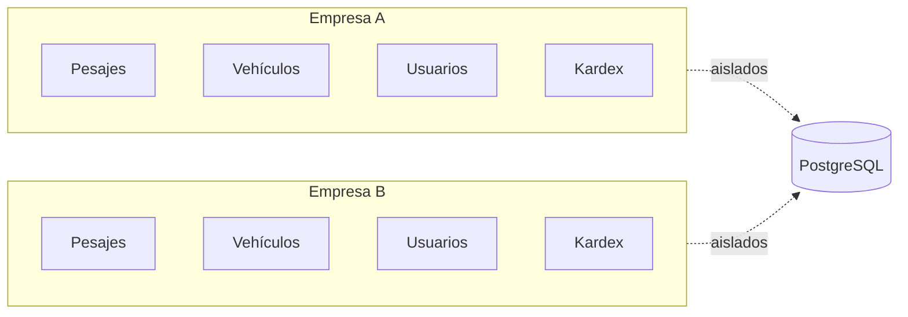

Regla de aislamiento: toda query multi-entidad filtra por `id_empresa` del JWT del usuario autenticado (`get_current_empresa` en `app/api/dependencies.py`).

## 4. Roles

| Rol            | Permisos                                                                       |
|----------------|--------------------------------------------------------------------------------|
| **ADMIN**      | Todo: catálogos, gestión, consultas, mantenimiento, usuarios, balanzas, licencia, pesaje manual |
| **SUPERVISOR** | Consultas, reportes, anular/modificar pesajes, ver logs, pesaje manual. No modifica catálogos ni config |
| **OPERADOR**   | Solo pesaje (entrada/salida), consulta básica de vehículos                     |

## 5. Workflow de Boleto

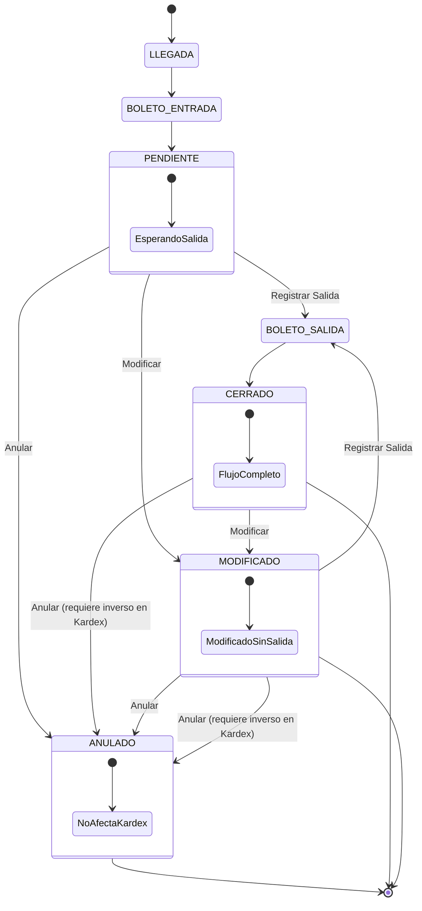

**Estados:**

| Estado        | Descripción                 | Reportes                                                |
|---------------|-----------------------------|---------------------------------------------------------|
| **PENDIENTE** | Tiene entrada, falta salida | Cuenta en "Tránsito"                                    |
| **CERRADO**   | Entrada + Salida completas  | Cuenta en Ingreso/Despacho                              |
| **MODIFICADO**| Boleto CERRADO/PENDIENTE editado; sigue abierto a salida | Cuenta en "Tránsito" mientras no tenga salida; al cerrar pasa a Ingreso/Despacho |
| **ANULADO**   | Anulado en entrada O salida | **NO** cuenta en reportes de gestión; solo en auditoría |

**Reglas:**

- Solo SUPERVISOR+ puede anular
- Anulación requiere motivo obligatorio (mínimo 10 caracteres)
- Un pesaje ANULADO no afecta Kardex directamente
- Si un pesaje CERRADO se anula, se registra su inverso en Kardex para cancelar el efecto del movimiento original
- PENDIENTE → solo puede hacerse SALIDA, MODIFICAR o ANULAR
- Un boleto CERRADO o PENDIENTE modificado pasa a **MODIFICADO** (mantiene el mismo número, no se reutiliza)
- MODIFICADO sigue abierto a salida: desde él se puede registrar SALIDA o ANULAR (si estuvo CERRADO, con inverso en Kardex)
- Cualquier boleto puede ser anulado, incluyendo los CERRADO

> **Nota de implementación (v2.0):** El backend **no tiene HAL** y no lee el indicador por serial/Modbus. El peso llega por API (`/api/v1/weighing/*`): el frontend/estación envía el peso leído, o lo captura en **modo manual** (restringido a ADMIN/SUPERVISOR). Los pasos "Leer peso de balanza", fotos y barreras describen el ciclo de producto y su integración futura vía estación/hardware; el backend actual recibe el peso como dato. Los timestamps se registran en UTC.

### 5.1 Workflow de Pesaje (Pantalla de Gestión)

```mermaid
flowchart TD
    INICIO[Operador entra a Gestión > Pesaje] --> PANTALLA[Pantalla de Pesaje]
    
    PANTALLA --> ENTRADA[Entrada]
    PANTALLA --> SALIDA[Salida]
    PANTALLA --> BUSCAR[Buscar]
    PANTALLA --> ANULAR[Anular]
    PANTALLA --> IMPRIMIR[Imprimir]
    PANTALLA --> SALIR[Salir]
    
    ENTRADA --> E1[Seleccionar tipo boleto: AUTO/MANUAL]
    E1 --> E2[Ingresar placa chuto]
    E2 --> E3[Seleccionar trailer si aplica]
    E3 --> E4[Seleccionar chofer]
    E4 --> E5[Seleccionar transporte]
    E5 --> E6[Seleccionar cliente/proveedor]
    E6 --> E7[Seleccionar producto]
    E7 --> E8[Seleccionar almacén]
    E8 --> E9{¿Modo automático?}
    E9 -->|Sí| E10[Leer peso de balanza]
    E9 -->|No| E11[Ingresar peso manual]
    E10 --> E12[Esperar estabilidad 3 seg]
    E11 --> E13[Ingresar peso trailer y remolque]
    E12 --> E14[Capturar fotos]
    E13 --> E14
    E14 --> E15[Crear boleto PENDIENTE]
    E15 --> E16[Registrar auditoría]
    E16 --> E17[Estación: subir barrera (futuro)]
    E17 --> PANTALLA
    
    SALIDA --> S1[Buscar boleto PENDIENTE]
    S1 --> S2[Mostrar datos del vehículo]
    S2 --> S3{¿Modo automático?}
    S3 -->|Sí| S4[Leer peso de balanza]
    S3 -->|No| S5[Ingresar peso manual]
    S4 --> S6[Esperar estabilidad 3 seg]
    S5 --> S7[Ingresar peso trailer y remolque]
    S6 --> S8[Capturar fotos]
    S7 --> S8
    S8 --> S9[Calcular peso neto]
    S9 --> S10[Actualizar boleto → CERRADO]
    S10 --> S11[Registrar en Kardex]
    S11 --> S12[Registrar auditoría]
    S12 --> S13[Estación: subir barrera (futuro)]
    S13 --> PANTALLA
    
    BUSCAR --> B1[Filtrar: número, placa, fecha, chofer]
    B1 --> B2[Mostrar resultados]
    B2 --> B3[Seleccionar boleto]
    B3 --> B4[Mostrar detalle en pantalla]
    B4 --> PANTALLA
    
    ANULAR --> A1{¿Tiene boleto seleccionado?}
    A1 -->|No| A2[Mostrar mensaje: Seleccione un boleto]
    A2 --> PANTALLA
    A1 -->|Sí| A3{¿Rol ≥ SUPERVISOR?}
    A3 -->|No| A4[Mostrar mensaje: Sin permisos]
    A4 --> PANTALLA
    A3 -->|Sí| A5[Solicitar motivo obligatorio]
    A5 --> A6[Marcar boleto ANULADO]
    A6 --> A7{¿Estaba CERRADO?}
    A7 -->|Sí| A8[Registrar inverso en Kardex]
    A7 -->|No| A9[No afecta Kardex]
    A8 --> A10[Registrar auditoría]
    A9 --> A10
    A10 --> PANTALLA
    
    IMPRIMIR --> I1{¿Tiene boleto seleccionado?}
    I1 -->|No| I2[Mostrar mensaje: Seleccione un boleto]
    I2 --> PANTALLA
    I1 -->|Sí| I3[Generar preview del boleto]
    I3 --> I4{¿Impresora configurada?}
    I4 -->|Sí| I5[Enviar a impresora]
    I4 -->|No| I6[Mostrar en pantalla]
    I5 --> PANTALLA
    I6 --> PANTALLA
    
    SALIR --> VOLVER[Volver al Dashboard]
```

### 5.2 Workflow de Entrada de Vehículo

```mermaid
flowchart TD
    INICIO[Operador presiona Entrada] --> TIPO{¿Tipo de boleto?}
    
    TIPO -->|AUTOMÁTICO| AUTO[Modo Automático]
    TIPO -->|MANUAL| MANU[Modo Manual]
    
    AUTO --> A1[Leer placa chuto]
    A1 --> A2[Leer placa trailer]
    A2 --> A3[Leer placa remolque si aplica]
    A3 --> A4[Seleccionar chofer]
    A4 --> A5[Seleccionar transporte]
    A5 --> A6[Seleccionar cliente/proveedor]
    A6 --> A7[Seleccionar producto]
    A7 --> A8[Seleccionar almacén]
    A8 --> A9[Leer peso de balanza entrada]
    A9 --> A10{¿Peso estable 3 seg?}
    A10 -->|No| A9
    A10 -->|Sí| A11{¿Unidad compatible?}
    A11 -->|No| A12[ALERTA: Unidad incompatible]
    A12 --> A13[No registrar - Verificar configuración]
    A11 -->|Sí| A14[Capturar foto chuto]
    A14 --> A15[Capturar foto trailer]
    A15 --> A16[Crear boleto PENDIENTE]
    
    MANU --> M1[Ingresar placa chuto]
    M1 --> M2[Ingresar placa trailer]
    M2 --> M3[Ingresar placa remolque si aplica]
    M3 --> M4[Seleccionar chofer]
    M4 --> M5[Seleccionar transporte]
    M5 --> M6[Seleccionar cliente/proveedor]
    M6 --> M7[Seleccionar producto]
    M7 --> M8[Seleccionar almacén]
    M8 --> M9[Ingresar peso trailer]
    M9 --> M10[Ingresar peso remolque si aplica]
    M10 --> M11[Ingresar documento y guía]
    M11 --> M12[Crear boleto PENDIENTE]
    
    A16 --> AUD[Registrar en auditoría]
    M12 --> AUD
    AUD --> HW[Estación: subir barrera (futuro)]
    HW --> OK[Boleto creado exitosamente]
    OK --> FIN[Operador continúa]
```

### 5.3 Workflow de Salida de Vehículo

```mermaid
flowchart TD
    INICIO[Operador presiona Salida] --> BUSCAR[Buscar boleto PENDIENTE]
    
    BUSCAR --> B1[Filtrar por placa]
    B1 --> B2[Mostrar resultados]
    B2 --> B3[Seleccionar boleto]
    B3 --> B4[Mostrar datos del vehículo]
    
    B4 --> TIPO{¿Tipo de boleto?}
    
    TIPO -->|AUTOMÁTICO| AUTO[Modo Automático]
    TIPO -->|MANUAL| MANU[Modo Manual]
    
    AUTO --> A1[Leer peso de balanza salida]
    A1 --> A2{¿Peso estable 3 seg?}
    A2 -->|No| A1
    A2 -->|Sí| A3{¿Unidad compatible?}
    A3 -->|No| A4[ALERTA: Unidad incompatible]
    A4 --> A5[No registrar - Verificar configuración]
    A3 -->|Sí| A6[Capturar foto chuto]
    A6 --> A7[Capturar foto trailer]
    A7 --> A8[Calcular peso neto]
    
    MANU --> M1[Ingresar peso trailer]
    M1 --> M2[Ingresar peso remolque si aplica]
    M2 --> M8
    
    A8 --> CALC{Calcular peso neto}
    CALC --> PESO[Peso neto = Peso entrada - Peso salida]
    PESO --> SIGNO{¿Peso neto?}
    
    SIGNO -->|> 0| INGRESO[INGRESO - Inventario aumenta]
    SIGNO -->|< 0| DESPACHO[DESPACHO - Inventario disminuye]
    SIGNO -->|= 0| CERO[Peso neto = 0 - Sin movimiento]
    
    INGRESO --> K1[Registrar ENTRADA en Kardex]
    DESPACHO --> K2[Registrar SALIDA en Kardex]
    CERO --> K3[No registrar en Kardex]
    
    K1 --> ACT[Actualizar boleto → CERRADO]
    K2 --> ACT
    K3 --> ACT
    
    ACT --> AUD[Registrar en auditoría]
    AUD --> HW[Estación: subir barrera (futuro)]
    HW --> OK[Salida registrada exitosamente]
    OK --> FIN[Operador continúa]
```

### 5.4 Workflow de Anulación de Boleto

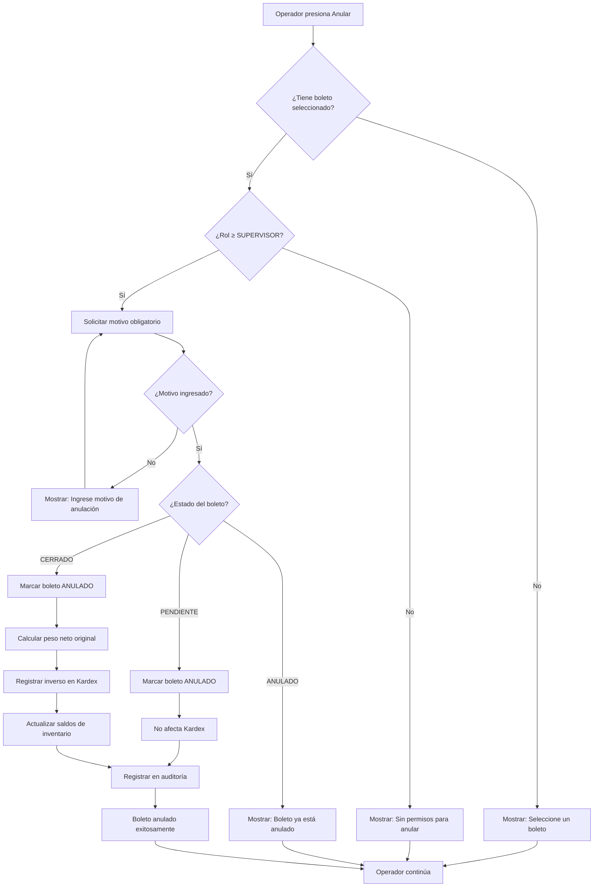

### 5.5 Workflow de Impresión de Boleto

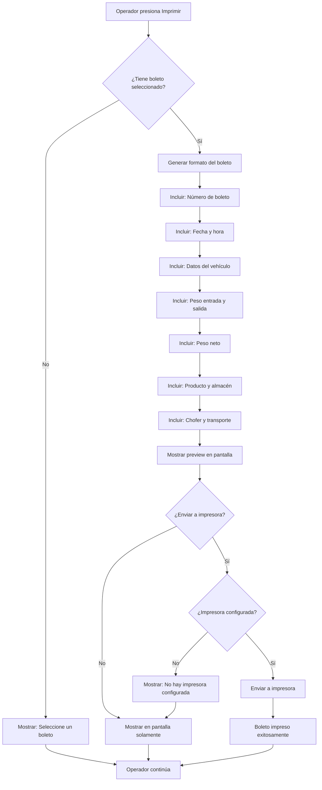

### 5.6 Workflow de Búsqueda de Boleto

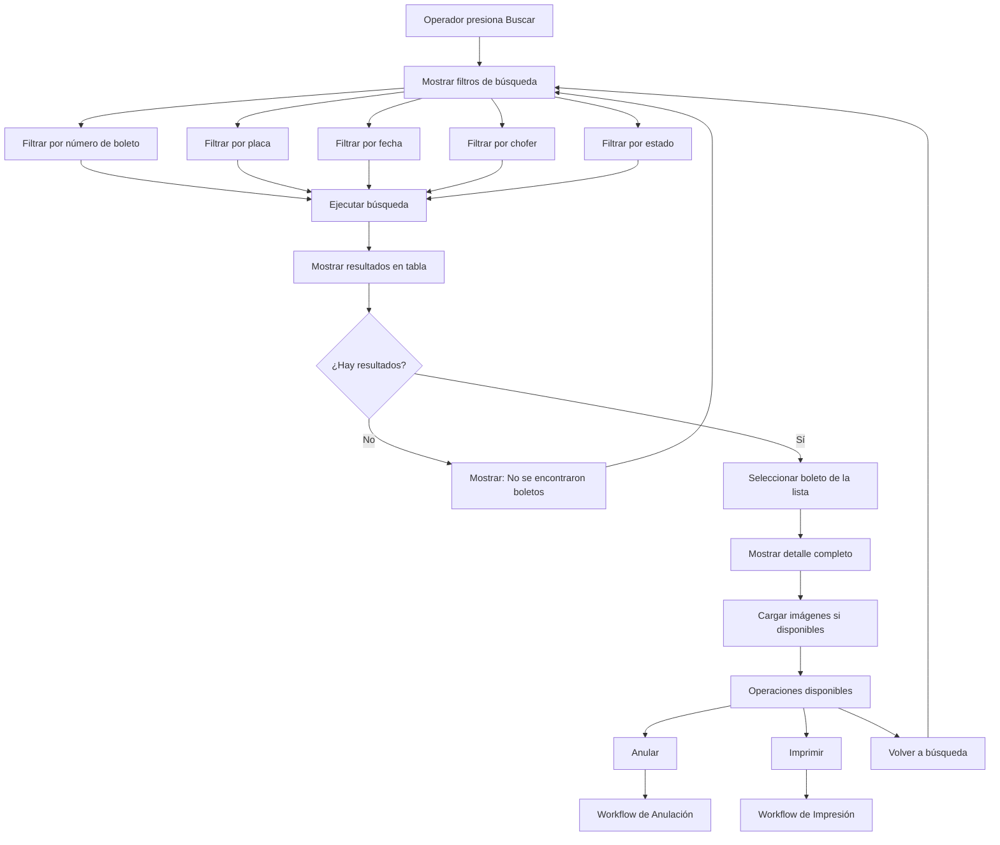

### 5.7 Workflow de Kardex

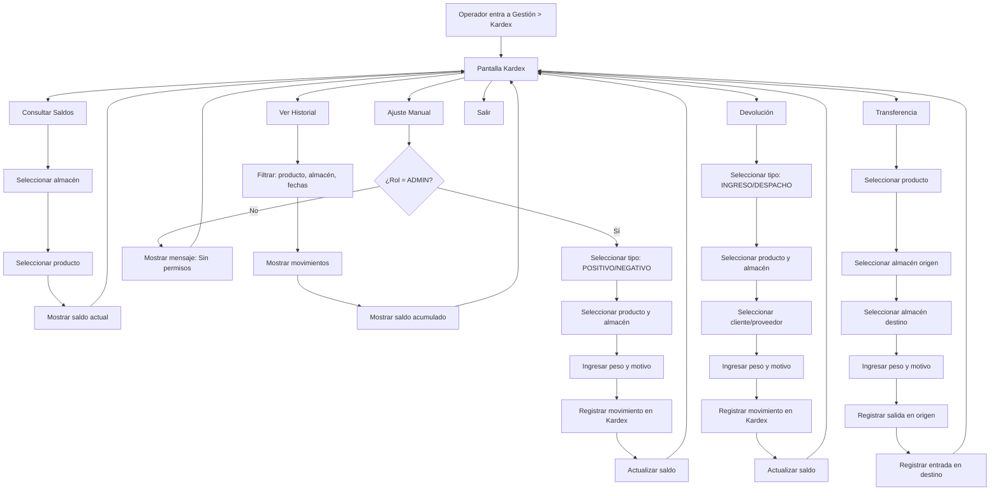

### 5.8 Workflow de Peso (Backend vía API / Estación futura)

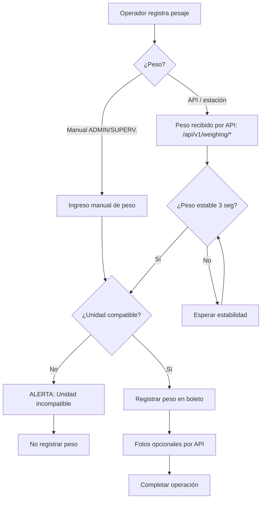

> **Sin HAL en backend (v2.0):** no hay cargador de HAL ni inicialización de indicadores/cámaras/barreras en el backend (ver nota de §5). La estación futura podrá leer el indicador (estabilidad 3 s, REQ-NF-ARQ-004), cámaras (RTSP/ONVIF) y barreras/semáforos; el backend los integra vía API/servicios.

### 5.9 Workflow de Login y Cambio de Empresa

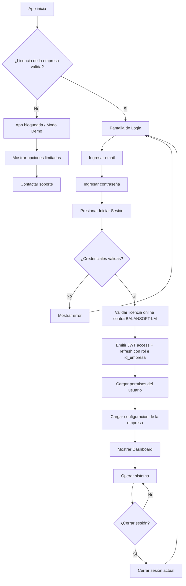

- Login por **email** (único); el backend valida BCrypt, estado de usuario/empresa y licencia contra el LM.
- La **empresa/estación se resuelve del JWT** (`id_empresa`, vía `get_current_empresa`); no hay selector de estación en el login.
- Tokens: `access_token` (corto) + `refresh_token`; endpoints `/api/v1/auth/login`, `/register`, `/refresh-token`, `/logout`, `/validate-license`.

## 6. Kardex (Control de Inventario por Peso)

Control de inventario por producto en kilos o libras.

### 6.1 Tipos de Movimiento (Kardex Numérico — MODEL.md)

Los movimientos de Kardex usan un **kardex numérico** (3. MODEL.md): el tipo de movimiento es un entero `id_movimiento` sin catálogo de conceptos textuales (`conceptos_kardex` no existe en el esquema real).

| ID     | Descripción              | Signo |
|--------|--------------------------|-------|
| 00     | SALDO INICIAL            | —     |
| 01-09  | Definible por el usuario | +     |
| **10** | **INGRESO POR BASCULA**  | **+** |
| 11-49  | Definible por el usuario | +     |
| 50-59  | Definible por el usuario | −     |
| **60** | **DESPACHO POR BASCULA** | **−** |
| 61-99  | Definible por el usuario | −     |

- Los IDs en el rango **01-49** son movimientos **positivos** (incrementan saldo).
- Los IDs en el rango **50-99** son movimientos **negativos** (decrementan saldo).
- Los rangos libres (01-09, 11-49, 50-59, 61-99) quedan definibles por el usuario en el futuro (ajustes, devoluciones, transferencias, consumos, etc.).

**Tabla `kardex`** (`backend/schema.sql`): `id_kardex` (UUID PK), `id_empresa` (UUID FK), **`id_movimiento`** (INTEGER), **`fecha_kardex`**, `id_producto`, `id_almacen`, `fecha_documento`, `documento`, **`valor`** (magnitud NUMERIC; el signo lo da `id_movimiento`), **`boleto`** (UUID FK a `boletos_pesaje`), `created_at`.

### 6.2 Flujo Kardex

El tipo de movimiento en Kardex se determina por el peso neto del boleto (entrada - salida):

- **Peso neto > 0** → INGRESO POR BASCULA (ID 10, positivo): el vehículo entró con producto y salió vacío, deja producto en el almacén
- **Peso neto < 0** → DESPACHO POR BASCULA (ID 60, negativo): el vehículo entró vacío y salió con producto, saca producto del almacén
- **Peso neto = 0** → sin movimiento (no se registra Kardex)

Los movimientos se registran **solo para productos marcados como `ES_KARDEX`** (al cerrar el boleto, en `WeighingService._registrar_kardex`).

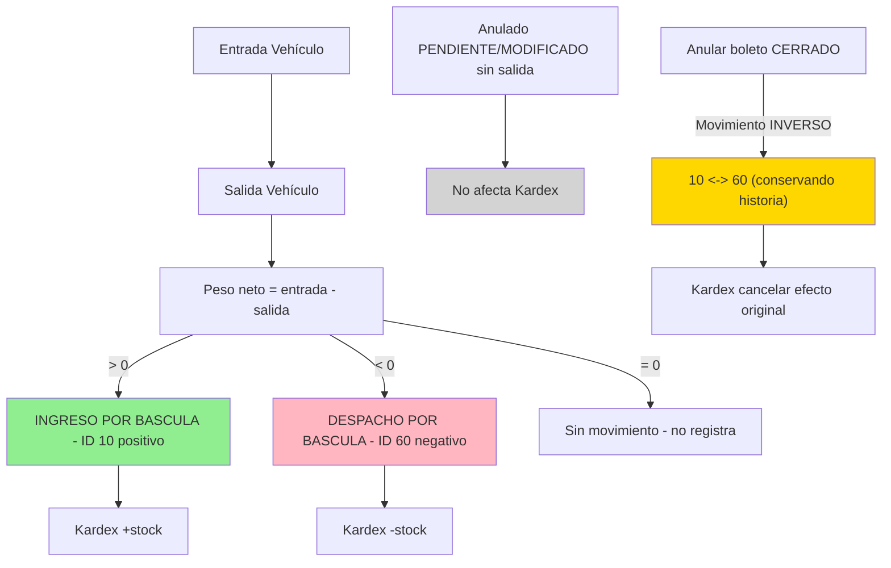

**Saldo a fecha de corte (MODEL.md):**

```text
SALDO FINAL = SALDO INICIAL + SUMA MOVIMIENTOS POSITIVOS − SUMA MOVIMIENTOS NEGATIVOS
FILTRO: A FECHA DE CORTE
```

**Regla de signos:**

- Peso neto > 0 (entrada > salida) → INGRESO (vehículo entra con producto, inventario aumenta)
- Peso neto < 0 (salida > entrada) → DESPACHO (vehículo sale con producto, inventario disminuye)

### 6.3 Movimientos Kardex

**Regla de negocio (invariante):** al anular un boleto **CERRADO** se registra el movimiento **inverso** en Kardex (INGRESO 10 ↔ DESPACHO 60) para cancelar el efecto del movimiento original, **sin eliminar ni reescribir la historia**. Los boletos ANULADOS nunca generan kardex; el número de boleto no se reutiliza.

Implementación vigente en el backend (Python/FastAPI, `app/services/weighing_service.py`):

```python
class WeighingService:
    async def _registrar_kardex(self, db, pesaje: BoletoPesaje) -> None:
        # Al cerrar el boleto:
        #   PNT >= 0 -> Kardex.KARDEX_INGRESO   (10, positivo, valor=abs(PNT))
        #   PNT <  0 -> Kardex.KARDEX_DESPACHO  (60, negativo, valor=abs(PNT))
        # Solo si producto.es_kardex.
        ...

    async def _registrar_kardex_inverso(self, db, pesaje: BoletoPesaje) -> None:
        # Por cada asiento original del boleto se agrega su opuesto
        # (INGRESO 10 <-> DESPACHO 60), conservando la historia.
        ...
```

Constantes del modelo: `Kardex.KARDEX_INGRESO = 10`, `Kardex.KARDEX_DESPACHO = 60` (`app/models/`). La consulta de saldo/historial se resuelve sumando movimientos a fecha de corte (rangos 01-49 positivos, 50-99 negativos).

### 6.4 Unidades

- Configurable por empresa: **KG** o **LIBRAS**
- Conversión: 1 kg = 2.20462 lbs (+ constantes en frontend/back)
- Unidad base para cálculos internos: KG
- Visualización según configuración de la empresa

## 7. Hardware

**⚠️ Implementación vigente: NO hay HAL (Hardware Abstraction Layer) en el backend.** El backend no lee indicadores por Serial/Modbus, no controla cámaras ni barreras ni semáforos. El peso se recibe por **API**:

- El frontend/estación envía el peso leído, o
- Se ingresa el peso en **modo manual** (restringido a **ADMIN/SUPERVISOR**, ver permisos `_PERMISOS_PESO_MANUAL` en `pesajes.py`), con fotos opcionales.

Hardware previsto como **requisito de producto** (integración futura vía estación, fuera del backend actual): indicador(es) serial RS232/RS485 multi-marca, cámaras IP (RTSP/ONVIF), semáforos y barreras por serial/USB, PC Windows/Linux con la app Flutter en kiosk. La regla de estabilidad de 3 s (REQ-NF-ARQ-004) aplica a esa lectura futura; el backend actual recibe el valor de peso ya estabilizado.

## 8. Arquitectura

### 8.1 Diagrama de Componentes

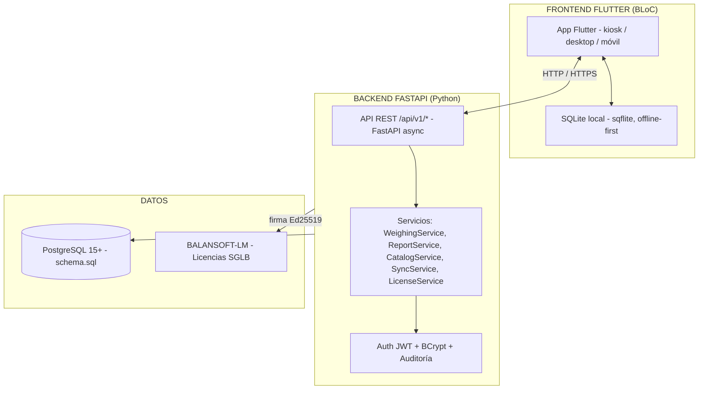

- Frontend Flutter consume la API REST bajo `/api/v1/*` (auth, pesajes, catálogos, reports, exports, sync, health).
- No hay ejecución in-process de servicios de dominio: todo pasa por HTTP + JWT.
- Los límites de licencia (tiers DEMO/MONOPUESTA/CENTRAL) se verifican contra BALANSOFT-LM.

### 8.2 Peso y Hardware (Contrato de API)

**No existe HAL en el backend.** El contrato de integración es la API: el peso llega como dato a `/api/v1/weighing/create` o `/close/{boleto}`:

| Campo                     | Descripción                                      |
|---------------------------|--------------------------------------------------|
| `peso_entrada_vehiculo`   | Peso de entrada (trailer principal)              |
| `peso_entrada_remolque`   | Peso de entrada del remolque (si aplica)         |
| `peso_salida_vehiculo`    | Peso de salida                                   |
| `peso_salida_remolque`    | Peso de salida del remolque (si aplica)          |
| `es_manual`               | Manual solo habilitado para ADMIN/SUPERVISOR (`_PERMISOS_PESO_MANUAL`) |
| `foto_*_url` / `imagenes` | Fotos opcionales (URLs / endpoint de imágenes)   |

La capa de hardware (indicadores serial/Modbus, cámaras RTSP, semáforos, barreras) se proyecta como **estación futura**; si se incorpora, vivirá fuera del backend FastAPI (frontend integrado o servicio de estación) exponiendo el mismo contrato de API. Esto mantiene desacoplada la lógica de negocio de los protocolos de hardware.

**Beneficios del contrato API vigente:**

- **REST JWT**: la UI Flutter autentica y opera vía HTTP; no hay dependencia de ejecución local.
- **Testeo**: el backend se prueba con pesos simulados (pytest) sin dispositivo físico.
- **Multi-peso**: soporta pesos por API y modo manual restringido sin cambios de esquema.
- **Extensible**: una estación futura puede publicar lecturas reales conservando el mismo API.

## 9. Frontend Flutter

App cliente **Flutter (Dart)** con **BLoC**, **offline-first** (SQLite local con `sqflite` + cola de sincronización), multi-plataforma (web/desktop/móvil) y modo kiosk. Consume la API REST bajo `/api/v1/*`.

### 9.1 Configuración de Ventana (Modo Kiosk)

| Modo           | Tamaño            | Descripción                        |
|----------------|-------------------|------------------------------------|
| **Desarrollo** | 1024 x 768 px     | Ventana resizable, minimizable     |
| **Producción** | Pantalla completa | Kiosko, sin bordes, no minimizable |

En Flutter la ventana se configura según `APP_ENV` (p. ej. `env_config.dart` / `app_config.dart`): en desarrollo la ventana es redimensionable y en producción se usa pantalla completa sin bordes (REQ-NF-OPE-001).

```dart
// Configuración según entorno (core/config/env_config.dart)
final appEnv = String.fromEnvironment('APP_ENV', defaultValue: 'production');
// development  -> ventana redimensionable
// production   -> kiosk: pantalla completa sin bordes
```

### 9.2 Login

```text
┌────────────────────────────────────────┐
│           BALANSOFT - Login            │
│                                        │
│  Email:    [________________]          │
│  Clave:    [________________]          │
│                                        │
│         [ Iniciar Sesión ]             │
│   ● Licencia: DEMO — expira 2027-01-01 │
│                                        │
└────────────────────────────────────────┘
```

**Regla:** Login por **email + contraseña** (BCrypt). Tras autenticar, el backend valida la **licencia de la empresa contra BALANSOFT-LM** y emite `access_token` + `refresh_token` (JWT con usuario, rol e `id_empresa`). No existe selector de "estación/tenant" en el login: la empresa se resuelve del JWT vía `get_current_empresa`.

### 9.3 Dashboard

```text
┌───────────────────────────────────────────────────────────────────┐
│  BALANSOFT   [Catálogos] [Gestión] [Consultar] [Mantenimiento]    │
│  ─────────────────────────────────────────────────────────────────│
│  Operador: Juan Pérez | Rol: OPERADOR | Empresa: Mi Empresa       │
│  ● Online (0 pendientes)                         [Cerrar Sesión]  │
├───────────────────────────────────────────────────────────────────┤
│                                                                   │
│  ┌───────────────┐ ┌───────────────┐ ┌───────────────┐ ┌────────┐ │
│  │ Pesajes Hoy   │ │ Pendientes    │ │ En Plataforma │ │ Cola   │ │
│  │     [47]      │ │      [5]      │ │      [1]      │ │  [3]   │ │
│  └───────────────┘ └───────────────┘ └───────────────┘ └────────┘ │
│                                                                   │
│  ┌───────────────────────────────────────────────────────────────┐│
│  │ PESO ENTRADA / SALIDA  │  FOTO CHUTO     │  FOTO TRAILER     ││
│  │                        │                 │                    ││
│  │     ███ 12,450 kg      │  [   imagen  ]  │  [   imagen  ]     ││
│  │    (API / manual)      │                 │                    ││
│  └────────────────────────┴─────────────────┴────────────────────┘│
│                                                                   │
│  Último: TA-00000001 → 12,450 kg neto - hace 2 min                │
│                                                                   │
└───────────────────────────────────────────────────────────────────┘
```

El peso mostrado es el recibido por API (lectura de estación futura o **modo manual** para ADMIN/SUPERVISOR); las fotos son opcionales. El tema claro/oscuro es persistente por dispositivo (`ThemeController`, REQ-NF-OPE-002).

### 9.4 Menús por Rol

**Catálogos** (ADMIN, SUPERVISOR para creación con permiso de catálogo):

- Clientes/Proveedores (terceros)
- Productos
- Catálogo/Línea
- Almacenes
- Marcas / Modelos de camión
- Camiones / Remolques
- Conductores
- Transportes
- Balanzas

**Gestión** (ADMIN, SUPERVISOR, OPERADOR):

- Pesaje (abre pantalla de gestión de pesaje)
- Historial de Pesajes
- **Kardex** (consultar saldos, movimientos por ID numérico)

**Operaciones dentro del Pesaje:**

| Operación    | Descripción                                                                          |
|--------------|--------------------------------------------------------------------------------------|
| **Entrada**  | Registra entrada del vehículo (pide datos requeridos: placa, chofer, producto, etc.); peso por API o manual* |
| **Salida**   | Registra salida (muestra vehículo actual, recibe peso salida)                       |
| **Buscar**   | Busca cualquier boleto por número, placa, fecha, etc. y lo muestra en pantalla       |
| **Modificar**| Edita el boleto mostrado → pasa a **MODIFICADO** (sigue abierto a salida)            |
| **Anular**   | Anula el boleto que se está mostrando (motivo obligatorio ≥ 10 caracteres, solo SUPERVISOR+) |
| **Imprimir** | Imprime el boleto actual (PDF ReportLab / preview)                                  |
| **Salir**    | Cierra la pantalla de pesaje y vuelve al dashboard                                   |

\* *Peso manual restringido a ADMIN/SUPERVISOR (`_PERMISOS_PESO_MANUAL`).*

**Consultar** (ADMIN, SUPERVISOR):

- Por camión
- Por fecha/rango
- Por producto
- Por cliente/proveedor
- Exportar (PDF/Excel)

**Mantenimiento** (ADMIN):

- Balanzas
- Usuarios
- Licencia (estado/tier contra BALANSOFT-LM)
- Parámetros del sistema
- Logs del sistema
- Sincronización (cola `sync_queue`, logs)

### 9.5 Pantalla Boleto (Pesaje)

```text
┌─────────────────────────────────────────────────────────────────────┐
│  BALANSOFT   [Catálogos] [Gestión] [Consultar] [Mantenimiento]      │
├─────────────────────────────────────────────────────────────────────┤
│  [← Volver]            GESTIÓN DE PESAJE                           │
├─────────────────────────────────────────────────────────────────────┤
│                                                                     │
│  Boleto: TA-00000001   Tipo: [MANUAL ▼]    Fecha: 07/09/2026        │
│  Estado: PENDIENTE                                                  │
├─────────────────────────────────────────────────────────────────────┤
│                                                                     │
│  ┌───────────────────────────────┐  ┌────────────────────────────┐  │
│  │  PLACA CHUTO                  │  │  PESO (API / MANUAL)       │  │
│  │  [_____________________] [S]  │  │                            │  │
│  │                               │  │      ███ 12,450 kg         │  │
│  │  PLACA TRAILER                │  │      (peso por API)        │  │
│  │  [_____________________] [S]  │  │                            │  │
│  │                               │  │  [ Manual (ADMIN/SUPERV.)] │  │
│  │  CHOFER                       │  └────────────────────────────┘  │
│  │  [ Juan Pérez      ▼]         │                                  │
│  │                               │  ┌────────────────────────────┐  │
│  │  TRANSPORTE                   │  │  FOTOS (opcional)          │  │
│  │  [ Transportes X   ▼]         │  │  Chuto: [ imagen / + ]     │  │
│  │                               │  │  Trailer: [ imagen / + ]   │  │
│  │  CLIENTE/PROVEEDOR            │  └────────────────────────────┘  │
│  │  [ Cementos SA     ▼]         │                                  │
│  │                               │                                  │
│  │  PRODUCTO                     │                                  │
│  │  [ Cemento        ▼]          │                                  │
│  │                               │                                  │
│  │  ALMACÉN                      │                                  │
│  │  [ Principal      ▼]          │                                  │
│  └───────────────────────────────┘                                  │
│                                                                     │
│  ┌────────────────────────────────────────────────────────────────┐ │
│  │  TRAILER: _______ kg    REMOLQUE: _______ kg                   │ │
│  │  DENSIDAD: _______     DOCUMENTO: [________]  GUÍA: [______]   │ │
│  └────────────────────────────────────────────────────────────────┘ │
│                                                                     │
│  Observaciones: [___________________________________________]       │
│                                                                     │
├─────────────────────────────────────────────────────────────────────┤
│  [ > Entrada ]  [ > Salida ]  [ [Edit] Modificar ]  [ [Search] Buscar ]
│  [ [X] Anular ]  [ [Print] Imprimir ]  [ [Exit] Salir ]              │
└─────────────────────────────────────────────────────────────────────┘
```

**Operaciones:**

| Botón         | Acción            | Descripción                                                       |
|---------------|-------------------|-------------------------------------------------------------------|
| `> Entrada`   | Registrar entrada | Valida datos requeridos, recibe peso (API/manual*), crea boleto PENDIENTE |
| `> Salida`    | Registrar salida  | Muestra vehículo actual, recibe peso salida, cierra boleto → CERRADO |
| `[Edit]`      | Modificar boleto  | Edita el boleto mostrado → pasa a **MODIFICADO** (sigue abierto a salida) |
| `[Search]`    | Buscar boleto     | Abre búsqueda por número, placa, fecha, chofer, etc.              |
| `[X]`         | Anular boleto     | Anula el boleto mostrado (motivo obligatorio ≥ 10 caracteres, SUPERVISOR+) |
| `[Print]`     | Imprimir boleto   | Genera ticket PDF (ReportLab) y lo muestra en pantalla            |
| `[Exit]`      | Salir             | Cierra pantalla de pesaje, vuelve al dashboard                    |

\* *Modo manual restringido a ADMIN/SUPERVISOR.*

### 9.6 Pantalla Kardex

```text
┌─────────────────────────────────────────────────────────────────────┐
│  BALANSOFT   [Catálogos] [Gestión] [Consultar] [Mantenimiento]      │
├─────────────────────────────────────────────────────────────────────┤
│  [← Volver]                KARDEX - INVENTARIO                      │
├─────────────────────────────────────────────────────────────────────┤
│                                                                     │
│  Almacén: [ Principal ▼]  Producto: [ Cemento ▼]  Unidad: KG        │
│  Desde: [01/08/2026]      Hasta: [11/08/2026]    [ Buscar ]         │
│                                                                     │
│  ┌─────────────────────────────────────────────────────────────────┐│
│  │ SALDO ACTUAL: 156,780.50 KG                                     ││
│  └─────────────────────────────────────────────────────────────────┘│
│                                                                     │
│  ┌─────────────────────────────────────────────────────────────────┐│
│  │ Fecha    │ Movimiento ID     │ Peso (kg)  │ Saldo      │ Ref    ││
│  ├──────────┼───────────────────┼────────────┼────────────┼──────  ┤│
│  │ 01/08    │ 10 INGRESO BASC   │ +12,450.00 │ 145,330.50 │ TA-... ││
│  │ 01/08    │ 60 DESPACHO BASC  │  -8,200.00 │ 137,130.50 │ TA-... ││
│  │ 02/08    │ 10 INGRESO BASC   │ +25,000.00 │ 162,130.50 │ TA-... ││
│  │ 03/08    │ 60 DESPACHO BASC  │ -500.00    │ 161,630.50 │ TA-... ││
│  │ ...      │ ...               │ ...        │ ...        │ ...    ││
│  └─────────────────────────────────────────────────────────────────┘│
│                                                                     │
│  [ [Export PDF] ]  [ [Export Excel] ]                         │
│                                                                     │
└─────────────────────────────────────────────────────────────────────┘
```

## 10. API REST y Servicios

> **Sí hay API REST y JWT.** El frontend Flutter consume los endpoints bajo `/api/v1/*` vía HTTP con token Bearer. La lógica de dominio vive en servicios FastAPI (Python) detrás de los endpoints; el contrato público son los endpoints.

### 10.1 Endpoints de la API

```text
--- Auth (/api/v1/auth) ---
POST /register            → crea empresa + usuario ADMIN (validation de licencia)
POST /login               → email + password (BCrypt) + validación licencia → access+refresh
POST /refresh-token       → renueva access token
POST /logout              → cierra sesión (revoca refresh)
POST /validate-license    → revalida licencia contra BALANSOFT-LM

--- Pesajes (/api/v1/weighing) ---
POST /create              → registra ENTRADA → boleto PENDIENTE (peso por API/manual*)
POST /close/{boleto}      → registra SALIDA → boleto CERRADO (+ primer movimiento Kardex)
PUT  /{boleto}            → modifica boleto → pasa a MODIFICADO (abierto a salida)
PUT  /{boleto}/anular     → anula (motivo obligatorio ≥ 10) [SUPERVISOR+]; inverso 10↔60 si estaba CERRADO
GET  /pendientes          → boletos abiertos (PENDIENTE/MODIFICADO sin salida)
GET  /list                → listado con filtros (fecha, vehículo, estado)
GET  /boleto/{boleto}     → detalle
GET  /{boleto}/pdf        → ticket PDF (ReportLab, marca de agua ANULADO)
GET/POST/DELETE /{boleto}/imagenes  → fotos opcionales

--- Catálogos (/api/v1/catalogo, /directorio, /flota, /inventario) ---
marcas, modelos-camion, camiones, remolques, transportes, conductores,
terceros, productos, almacenes, balanzas → GET/POST/PUT/DELETE (CRUD)
(escritura con dependencias require_catalog_manager / require_admin)

--- Reports & Exports (/api/v1/reports) ---
GET /daily | /monthly | /vehicle/{id} | /export/excel  → reportes; los ANULADOS no cuentan (solo auditoría)

--- Sync (/api/v1/sync) ---
POST /push   → sube pendientes offline (cola BDD local)
GET  /pull   → baja datos del servidor
GET  /status → estado de la cola

--- Health ---
GET /api/v1/health (o /health) → estado del servicio
```

\* *Modo manual restringido a ADMIN/SUPERVISOR (`_PERMISOS_PESO_MANUAL` en `pesajes.py`).*

### 10.2 Lógica de Pesaje

Estados del boleto (constantes en `app/models/`): `ESTADO_PENDIENTE`, `ESTADO_CERRADO`, `ESTADO_MODIFICADO`, `ESTADO_ANULADO` (los valores legacy `COMPLETADO`/`ABIERTO`/`AUTOMATICO` se normalizan en `WeighingService.normalizar_estado`).

`WeighingService` (`app/services/weighing_service.py`):

```python
async def generar_numero_boleto(self, db) -> str:
    # Serie secuencial configurable (boleto_prefix, boleto_digitos), p. ej. TA-00000001.
    # El número no se reutiliza (único por empresa).

async def create(self, req, empresa, usuario):
    # 1. Generar número de boleto (no reutilizable)
    # 2. Recibir peso de entrada (por API) o manual* (solo ADMIN/SUPERVISOR)
    # 3. Calcular PTE / PNT (fórmulas MODEL.md)
    # 4. Crear boleto estado=PENDIENTE
    # 5. Registrar auditoría (usuario, IP, timestamp UTC, cambios)
    # 6. Fotografías opcionales (endpoint de imágenes)

async def close(self, boleto, req, empresa, usuario):
    # 1. Buscar boleto PENDIENTE/MODIFICADO (abierto) de la empresa
    # 2. Recibir peso de salida (API) o manual*
    # 3. Calcular PTS / PNT / otras fórmulas MODEL.md
    # 4. Actualizar boleto → CERRADO (libera el vehículo)
    # 5. Registrar primer movimiento Kardex (10 si PNT ≥ 0, 60 si PNT < 0;
    #    solo productos ES_KARDEX)
    # 6. Registrar auditoría

async def update(self, boleto, req, empresa, usuario):
    # 1. Boleto ANULADO → rechazar
    # 2. Si estaba CERRADO → pasa a MODIFICADO; si estaba PENDIENTE → MODIFICADO
    # 3. MODIFICADO sigue abierto a salida
    # 4. Registrar auditoría (creado_por/salida_por/modificado_por)

async def anular(self, boleto, data, empresa, anulado_por):
    # 1. Motivo obligatorio (≥ 10 caracteres, 422 si falta/rango)
    # 2. Marcar ANULADO + motivo (no se pierde el correlativo)
    # 3. Si estaba CERRADO → _registrar_kardex_inverso (10 ↔ 60)
    #    cancelando el efecto, conservando historia (NO borra)
    # 4. Auditoría (anulado_por)
```

La anulación queda restringida por permisos (`_PERMISOS_ANULACION = {ADMIN, SUPERVISOR}`). El ticket PDF se genera en `ReportService`/`ticket_service.py` (ReportLab).

## 11. Base de Datos

### 11.1 Modelo Entidad-Relación (MER)

Fuente autoritativa del esquema: **`backend/schema.sql`** (PostgreSQL, esquema final idempotente, `CREATE TABLE IF NOT EXISTS`) + **`backend/migrations/*.sql`** hacia adelante (sin Alembic). Toda entidad lleva `id_empresa` (**UUID**) FK a `empresas`; los timestamps se guardan en **UTC**. Módulos: flota (marcas, modelos_camion, camiones, remolques), directorio (transportes, conductores, terceros), inventario (productos, almacenes, balanzas) y transaccional (boletos_pesaje, imagenes_pesaje, kardex, sync, auditoria).

```mermaid
erDiagram
    empresas ||--o{ usuarios : tiene
    empresas ||--o{ transportes : tiene
    empresas ||--o{ marcas : tiene
    empresas ||--o{ modelos_camion : tiene
    empresas ||--o{ camiones : tiene
    empresas ||--o{ remolques : tiene
    empresas ||--o{ conductores : tiene
    empresas ||--o{ terceros : tiene
    empresas ||--o{ productos : tiene
    empresas ||--o{ almacenes : tiene
    empresas ||--o{ balanzas : tiene
    empresas ||--o{ boletos_pesaje : tiene
    empresas ||--o{ kardex : tiene
    empresas ||--o{ sync_queue : tiene
    empresas ||--o{ sync_logs : tiene
    empresas ||--o{ auditoria : tiene

    marcas ||--o{ modelos_camion : define
    modelos_camion ||--o{ camiones : compone
    transportes ||--o{ camiones : posee
    transportes ||--o{ conductores : emplea
    camiones }o--o| remolques : opcional
    balanzas ||--o{ boletos_pesaje : pesa
    productos ||--o{ kardex : registra
    almacenes ||--o{ kardex : ubica

    boletos_pesaje }o--o| camiones : vehiculo
    boletos_pesaje }o--o| conductores : conductor
    boletos_pesaje }o--o| transportes : transporta
    boletos_pesaje }o--o| remolques : remolque
    boletos_pesaje }o--|| productos : contiene
    boletos_pesaje }o--|| almacenes : ubicado_en
    boletos_pesaje }o--o| terceros : tercero
    boletos_pesaje ||--o| kardex : genera
    boletos_pesaje ||--o{ imagenes_pesaje : fotos
    boletos_pesaje ||--o{ auditoria : audita
    kardex }o--|| boletos_pesaje : boleto
    auditoria }o--o| usuarios : realizado_por

    empresas {
        UUID id_empresa PK
        VARCHAR licencia_key
        VARCHAR licencia_tier
        VARCHAR licencia_status
        TIMESTAMP licencia_expira
        BOOLEAN activa
    }

    usuarios {
        UUID id_usuario PK
        UUID id_empresa FK
        VARCHAR email UNIQUE
        VARCHAR password_hash
        VARCHAR rol
        BOOLEAN activo
    }

    boletos_pesaje {
        UUID boleto PK
        VARCHAR numero_boleto UNIQUE
        UUID id_empresa FK
        TIMESTAMP fecha_hora_entrada
        NUMERIC peso_entrada_vehiculo
        NUMERIC peso_entrada_remolque
        TIMESTAMP fecha_hora_salida
        NUMERIC peso_salida_vehiculo
        NUMERIC peso_salida_remolque
        NUMERIC peso_total_entrada
        NUMERIC peso_total_salida
        NUMERIC peso_neto
        NUMERIC peso_neto_declarado
        NUMERIC peso_diferencia
        NUMERIC porcentaje_desviacion
        VARCHAR estado_boleto
        TEXT motivo_anulacion
        BOOLEAN sincronizado
    }

    kardex {
        UUID id_kardex PK
        UUID id_empresa FK
        INTEGER id_movimiento
        TIMESTAMP fecha_kardex
        UUID id_producto FK
        UUID id_almacen FK
        TIMESTAMP fecha_documento
        VARCHAR documento
        NUMERIC valor
        UUID boleto FK
    }

    imagenes_pesaje {
        UUID id_imagen PK
        UUID boleto FK
        VARCHAR tipo
        TEXT url
    }

    sync_queue {
        UUID id_sync PK
        UUID id_empresa FK
        VARCHAR entidad
        VARCHAR operacion
        JSONB payload
        BOOLEAN pendiente
    }

    auditoria {
        UUID id_auditoria PK
        UUID id_usuario FK
        UUID id_empresa FK
        VARCHAR accion
        JSONB detalle
        VARCHAR ip
        TIMESTAMP created_at
    }

    configuraciones {
        VARCHAR clave PK
        TEXT valor
        JSONB metadatos
    }
```

### 11.2 Esquema SQL y Migraciones

- **Esquema final idempotente**: `backend/schema.sql` (toda la BD en un solo script re-ejecutable).
- **Migraciones hacia adelante**: `backend/migrations/*.sql` (p. ej. `001_remolques_y_fotos.sql`, `002_spec_arquitectura.sql`, `003_reglas_negocio_model.md.sql`) — **sin Alembic**.
- **Instalación / actualización / seed**: `backend/scripts/setup_db.sh` (modos `instalar`, `aplicar-migraciones`, `seed`); seed opcional con `backend/scripts/seed_data.py` y `seed_simulacion.py`.
- La BD de tests es **PostgreSQL real** (`balansoft_ws_test`); no se usa SQLite en desarrollo.
- Campos JSON en **`JSONB`** (auditoría, logs, sync_queue) → REQ-NF-ARQ-009.

Extracto representativo (PostgreSQL / `schema.sql`):

```sql
-- Empresas (multi-empresa, id_empresa UUID)
CREATE TABLE IF NOT EXISTS empresas (
    id_empresa       UUID PRIMARY KEY DEFAULT gen_random_uuid(),
    nombre_fiscal    VARCHAR(255) NOT NULL,
    rif_nit          VARCHAR(20) NOT NULL UNIQUE,
    licencia_key     VARCHAR(255),
    licencia_tier    VARCHAR(20),            -- DEMO / MONOPUESTA / CENTRAL
    licencia_status  VARCHAR(20),
    licencia_expira  TIMESTAMP,
    activa           BOOLEAN NOT NULL DEFAULT TRUE,
    created_at       TIMESTAMP NOT NULL DEFAULT CURRENT_TIMESTAMP
);

-- Usuarios (login por email, BCrypt)
CREATE TABLE IF NOT EXISTS usuarios (
    id_usuario       UUID PRIMARY KEY DEFAULT gen_random_uuid(),
    id_empresa       UUID NOT NULL REFERENCES empresas(id_empresa),
    email            VARCHAR(255) NOT NULL UNIQUE,
    password_hash    VARCHAR(255) NOT NULL,
    rol              VARCHAR(30) NOT NULL DEFAULT 'OPERADOR', -- ADMIN / SUPERVISOR / OPERADOR
    activo           BOOLEAN NOT NULL DEFAULT TRUE
);

-- Boletos (serie TA-00000001 secuencial no reutilizable)
CREATE TABLE IF NOT EXISTS boletos_pesaje (
    boleto                   UUID PRIMARY KEY DEFAULT gen_random_uuid(),
    numero_boleto            VARCHAR(30) UNIQUE,
    id_empresa               UUID NOT NULL REFERENCES empresas(id_empresa),
    fecha_hora_entrada       TIMESTAMP NOT NULL,
    peso_entrada_vehiculo    NUMERIC(12,2) NOT NULL,
    peso_entrada_remolque    NUMERIC(12,2),
    fecha_hora_salida        TIMESTAMP,
    peso_salida_vehiculo     NUMERIC(12,2),
    peso_total_entrada       NUMERIC(12,2),
    peso_total_salida        NUMERIC(12,2),
    peso_neto                NUMERIC(12,2),
    peso_neto_declarado      NUMERIC(12,2),
    peso_diferencia          NUMERIC(12,2),
    porcentaje_desviacion    NUMERIC(8,4),
    motivo_anulacion         TEXT,
    estado_boleto            VARCHAR(20) NOT NULL DEFAULT 'PENDIENTE', -- PENDIENTE / CERRADO / MODIFICADO / ANULADO
    sincronizado             BOOLEAN NOT NULL DEFAULT FALSE
);

-- Kardex (MODEL.md: 10 = INGRESO POR BASCULA, 60 = DESPACHO POR BASCULA)
CREATE TABLE IF NOT EXISTS kardex (
    id_kardex       UUID PRIMARY KEY DEFAULT gen_random_uuid(),
    id_empresa      UUID NOT NULL REFERENCES empresas(id_empresa),
    id_movimiento   INTEGER NOT NULL,            -- 01-49 positivos, 50-99 negativos
    fecha_kardex    TIMESTAMP NOT NULL,
    id_producto     UUID REFERENCES productos(id_producto),
    id_almacen      UUID REFERENCES almacenes(id_almacen),
    fecha_documento TIMESTAMP,
    documento       VARCHAR(100),
    valor           NUMERIC(12,2) NOT NULL,      -- magnitud; signo según id_movimiento
    boleto          UUID REFERENCES boletos_pesaje(boleto)
);
```

Índices clave: `idx_kardex_empresa_fecha`, `idx_kardex_producto_almacen` y filtros por `id_empresa` en toda query (REQ-NF-ARQ-001).

## 12. Modo Offline (Sync)

- **Offline-first**: el frontend Flutter guarda local en **SQLite (sqflite)** y encola operaciones en la cola `pendiente/sincronizado`.
- Cuando hay internet, sincroniza vía endpoints `/api/v1/sync/*` (`push`, `pull`, `status`) soportados por las tablas `sync_queue`/`sync_logs` del backend.
- Indicador: "● Online" / "○ Offline (X pendientes)".

## 13. Seguridad

- **Passwords con BCrypt** (passlib) → validación en `/api/v1/auth/login`.
- **Sesión con JWT** (python-jose, HS256): `access_token` corto + `refresh_token`; el token contiene usuario y rol, y la empresa se resuelve por `id_empresa` del usuario (`get_current_empresa` en `app/api/dependencies.py`).
- **Sí hay API REST protegida**: toda ruta bajo `/api/v1/*` exige Bearer token; los permisos de escritura usan dependencias `require_catalog_manager` / `require_admin`; el peso manual y la anulación usan `_PERMISOS_PESO_MANUAL` / `_PERMISOS_ANULACION` (ADMIN/SUPERVISOR).
- Roles: ADMIN, SUPERVISOR, OPERADOR.
- Multi-empresa: toda query filtra por `id_empresa` (REQ-NF-ARQ-001).
- **Auditoría completa de boletos:** `AuditMiddleware` + tabla `auditoria` registran usuario, IP, timestamp UTC y cambios (JSONB) (REQ-NF-SEG-001).

## 14. Zona Horaria

**Regla:** PostgreSQL almacena **todos** los timestamps en **UTC**. La hora local **nunca** se persiste — solo se computa al visualizar.

- En backend (Python/FastAPI), cualquier timestamp que vaya a persistirse se obtiene con `datetime.now(UTC)` (nunca hora local) y los DTOs/entidades no llevan sufijo `Utc`, aunque siempre se almacenan en UTC (REQ-NF-ARQ-010/011).
- La conversión a la zona de la empresa ocurre **solo** en la capa de presentación (**Flutter**), según el `timezone` configurado (REQ-NF-ARQ-012).

| Capa       | Almacenamiento     | Visualización                                     |
|------------|--------------------|---------------------------------------------------|
| PostgreSQL | `TIMESTAMP` UTC    | Conversión en query (`AT TIME ZONE`)              |
| Backend    | `datetime.now(UTC)`| Devuelve UTC en DTOs                              |
| Flutter    | UTC                | Conversión a local en UI (según configuración)    |

```sql
-- PostgreSQL: fecha local desde UTC
SELECT fecha_hora_entrada AT TIME ZONE 'UTC' AT TIME ZONE 'America/Caracas' AS fecha_local
FROM boletos_pesaje;
```

```python
# Backend: los timestamps se generan SIEMPRE en UTC
from datetime import UTC, datetime
ahora_utc = datetime.now(UTC)
# El servicio devuelve UTC; la UI (Flutter) convierte a local con la TZ de la empresa
```

## 15. Formatos Configurables

### 15.1 Configuración por Empresa

| Parámetro | Valor Default | Opciones |
| ----------- | --------------- | ---------- |
| `sistema_unidades` | METRICO | METRICO, IMPERIAL |
| `unidad_peso` | KG | KG (métrico), LBS (imperial) |
| `unidad_volumen` | LITROS | LITROS, GALONES |
| `formato_numerico` | #,##0.00 | Configurable |
| `formato_fecha` | DD/MM/YYYY | DD/MM/YYYY, MM/DD/YYYY, YYYY-MM-DD |
| `formato_hora` | HH:MM | HH:MM, HH:MM:SS |
| `separador_decimal` | , | , o . |
| `separador_miles` | . | . o , |

### 15.2 Conversiones

Constantes compartidas (frontend/back; sin servicio dedicado — REQ-NF-ARQ-006).

```python
# Unidad base interna: KG
KG_TO_LBS = 2.20462
LBS_TO_KG = 0.453592
LITROS_TO_GALONES = 0.264172
GALONES_TO_LITROS = 3.78541

def kg_to_lbs(kg: float) -> float:
    return round(kg * KG_TO_LBS, 2)

def lbs_to_kg(lbs: float) -> float:
    return round(lbs * LBS_TO_KG, 2)
```

### 15.3 Validación de Lectura

**Regla:** Si la lectura del indicador no coincide con el sistema configurado, mostrar ALERTA y NO registrar.

```python
class ValidacionPeso:
    def validar_lectura(self, config, peso_lector: float, unidad_lector: str):
        sistema = config.sistema_unidades  # "METRICO" o "IMPERIAL"

        if sistema == "METRICO" and unidad_lector.upper() == "LBS":
            return Invalid("ALERTA: Indicador configurado en LBS pero sistema es Métrico (KG)",
                           peso_lector, unidad_lector)

        if sistema == "IMPERIAL" and unidad_lector.upper() == "KG":
            return Invalid("ALERTA: Indicador configurado en KG pero sistema es Imperial (LBS)",
                           peso_lector, unidad_lector)

        return Valid()
```

### 15.4 Validación de Estabilidad

**Regla:** El peso se acepta solo si la estabilidad se mantiene por **3 segundos**.

```python
class EstabilidadService:
    TIEMPO_ESTABILIDAD_SEGUNDOS = 3

    def evaluar_estabilidad(self, peso_actual: float, es_estable: bool):
        # Regla: SIEMPRE UTC al persistir (la conversión a TZ local va en la capa de presentación).
        ahora = datetime.now(UTC)
        if not es_estable:
            self._tiempo_estable_inicio = None
            self._peso_estable = None
            return Waiting(self.TIEMPO_ESTABILIDAD_SEGUNDOS)
        if self._tiempo_estable_inicio is None:
            self._tiempo_estable_inicio = ahora
            self._peso_estable = peso_actual
            return Stabilizing(self.TIEMPO_ESTABILIDAD_SEGUNDOS)
        tiempo = (ahora - self._tiempo_estable_inicio).total_seconds()
        if tiempo >= self.TIEMPO_ESTABILIDAD_SEGUNDOS:
            return Accepted(self._peso_estable, tiempo)
        return Stabilizing(self.TIEMPO_ESTABILIDAD_SEGUNDOS - tiempo)
```

> La estabilidad de 3 s (REQ-NF-ARQ-004) es requisito de producto; en la implementación vigente (sin HAL en backend) la evaluación corresponde a la lectura de estación futura — el backend recibe el peso ya estabilizado como dato.

### 15.5 UI - Indicador de Estabilidad

```text
┌─────────────────────────────────────────────────────────────────┐
│  INDICADOR DE PESO                                              │
├─────────────────────────────────────────────────────────────────┤
│                                                                 │
│              ███ 12,450 kg                                      │
│                                                                 │
│              ● ESTABLE                                          │
│                                                                 │
│  ┌───────────────────────────────────────────────────────────┐  │
│  │  Estabilidad: ████████████░░░░░░░░  2.5s / 3.0s           │  │
│  └───────────────────────────────────────────────────────────┘  │
│                                                                 │
│  [Capturar Peso] [ Manual (ADMIN/SUPERV.) ]                      │
│                                                                 │
└─────────────────────────────────────────────────────────────────┘
```

### 15.6 UI - Alerta de Incompatibilidad

```text
┌─────────────────────────────────────────────────────────────────┐
│  [ALERT] INCOMPATIBILIDAD DE UNIDADES                      │
├─────────────────────────────────────────────────────────────────┤
│                                                                 │
│  El indicador está reportando: 12,450 LBS                       │
│  El sistema está configurado para: KG (Métrico)                 │
│                                                                 │
│  No se puede registrar el peso.                                 │
│                                                                 │
│  Acciones:                                                      │
│  1. Verificar configuración del indicador                       │
│  2. Cambiar sistema de unidades de la empresa                   │
│  3. Contactar soporte técnico                                   │
│                                                                 │
│              [ Cerrar ]                                         │
│                                                                 │
└─────────────────────────────────────────────────────────────────┘
```

### 15.7 Fórmulas de Cálculo (MODEL.md)

Constantes implementadas en `WeighingService._calcular` y campos de `boletos_pesaje`:

| Sigla | Descripción                               | Fórmula                              |
|-------|-------------------------------------------|--------------------------------------|
| PTE   | Peso total entrada                        | `PEC + PER`                          |
| PTS   | Peso total salida                         | `PSC + PSR`                          |
| PEC   | Peso entrada camión (chuto + trailer)     | dato                                 |
| PSC   | Peso salida camión (chuto + trailer)      | dato                                 |
| PER   | Peso entrada remolque                     | dato                                 |
| PSR   | Peso salida remolque                      | dato                                 |
| PNT   | Peso neto total                           | `PTE − PTS` (firmado)                |
| PND   | Peso neto declarado (el de la guía)       | dato                                 |
| PDF   | Peso diferencia                           | `PNT − PND` (±)                      |
| PDV   | Porcentaje desviación                     | `PDF / PND (%)`                      |

- Al cerrar, el boleto queda con el conjunto completo (PTE/PTS/PNT/PND/PDF/PDV) calculado en UTC.
- `PNT ≥ 0` → INGRESO POR BASCULA (10); `PNT < 0` → DESPACHO POR BASCULA (60); `PNT = 0` → sin movimiento.
- Tolerancia comercial: configurada en la maestra de productos (`productos.tolerancia`); la tabla de tolerancias por industria de MODEL.md es solo informativa.

## 16. Licenciamiento (BALANSOFT-LM)

Validación de licencia contra **BALANSOFT-LM** (SGLB, License Manager). Implementado en backend vía **cliente HTTP** (`app/core/license_client.py` + `app/services/license_service.py`) con firma **Ed25519** anti-fake-server y caché.

| Aspecto      | Detalle                                                  |
|--------------|----------------------------------------------------------|
| Servicio     | BALANSOFT-LM / SGLB (externo o local)                    |
| Protocolo    | HTTP: `/token`, `/validate` con respuesta **firmada Ed25519** (verificación de clave pública + `server_time` anti-replay) |
| Validación   | En `/api/v1/auth/login` y `/validate-license`            |
| Tiers        | **DEMO / MONOPUESTA / CENTRAL** (límites de registros configurables) |
| Producto     | `LICENSE_PRODUCT_CODE` (config `license_product_code`)   |
| Modo offline | Estado/tier cacheado en `empresas` (`licencia_status`, `licencia_expira`) |
| Estado       | Implementado                                            |

**Flujo:**

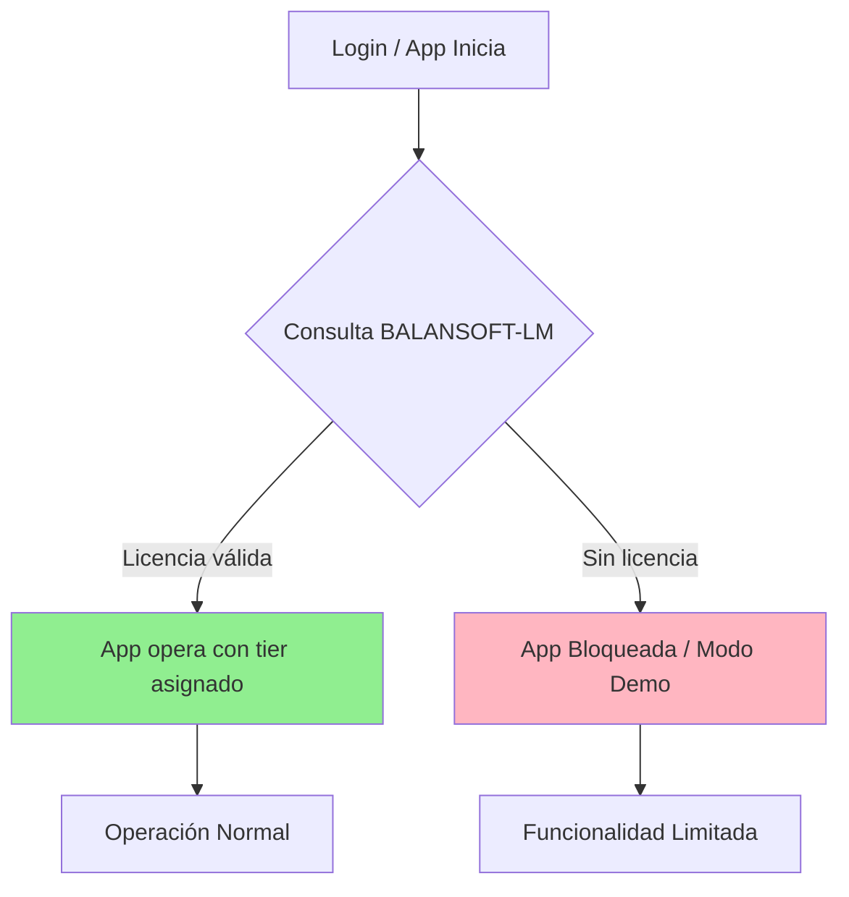

El tier DEMO aplica límites (p. ej. `DEMO_MAX_RECORDS`) verificados en `WeighingService.verificar_limite_demo`.

## 17. Plan de Contingencia - Balanzas

### 17.1 Configuración

Cada balanza se configura con tipo:

- **ENTRADA** - Para registro de llegada
- **SALIDA** - Para registro de salida

Puede haber múltiples balanzas de cada tipo para contingencia.

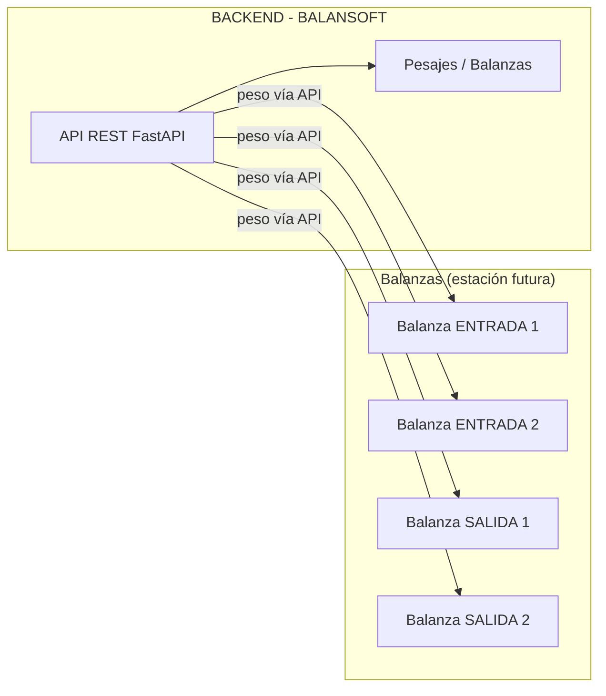

> En la implementación vigente no hay HAL: los pesos llegan por API. La contingencia de comunicación queda definida por el flujo inferior y se materializa como **Modo MANUAL** (restringido a ADMIN/SUPERVISOR).

### 17.2 Tipos de Fallo

| Tipo de Fallo          | Causa                                               | Solución                                             |
|------------------------|-----------------------------------------------------|------------------------------------------------------|
| **Fallo FÍSICO**       | Celdas dañadas, mantenimiento, báscula no operativa | Mover camión a otra báscula operativa del mismo tipo |
| **Fallo COMUNICACIÓN** | PC no se conecta al dispositivo                     | Modo MANUAL (ingreso de peso manual)                 |

### 17.3 Escenarios - Fallo Físico (Mover Camión)

| Escenario | Solución |
| ----------- | ---------- |
| Balanza ENTRADA 1 en mantenimiento | Mover camión a Balanza ENTRADA 2 (si existe) |
| Balanza SALIDA 1 con celdas dañadas | Mover camión a Balanza SALIDA 2 (si existe) |
| No hay otra balanza disponible del mismo tipo | Modo MANUAL para esa operación |

**Flujo:**

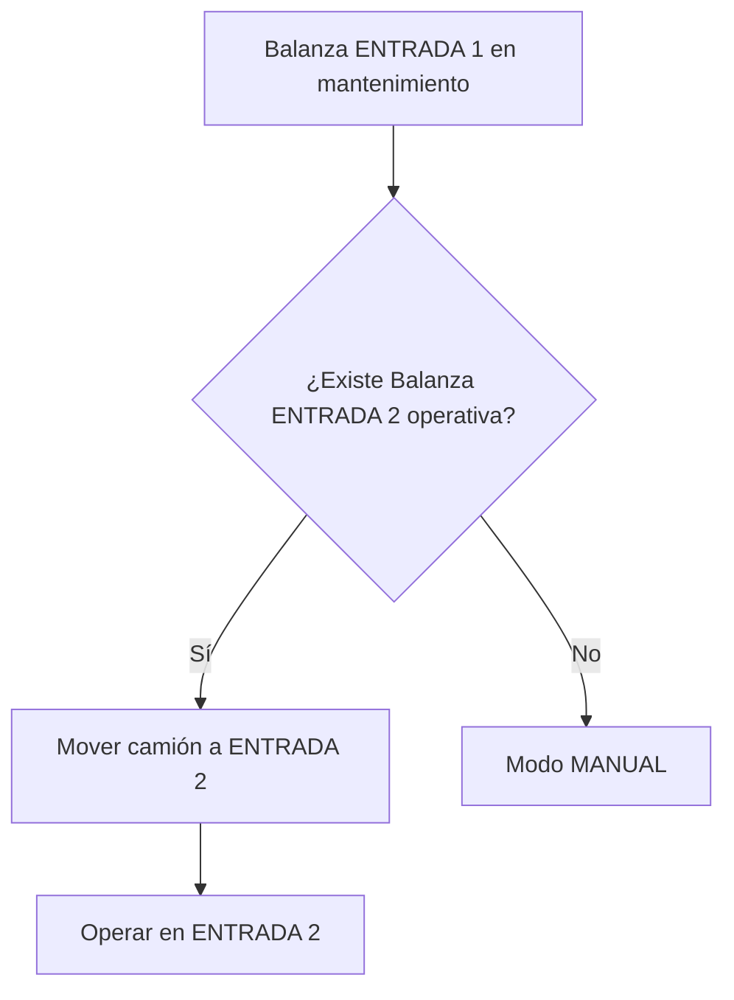

### 17.4 Escenarios - Fallo Comunicación (Modo MANUAL)

| Escenario                       | Solución                         |
|---------------------------------|----------------------------------|
| Indicador no responde (timeout) | Reintentar 3 veces → Modo MANUAL |
| Puerto serial bloqueado         | Modo MANUAL                      |
| Dispositivo desconectado        | Modo MANUAL                      |

**Flujo:**

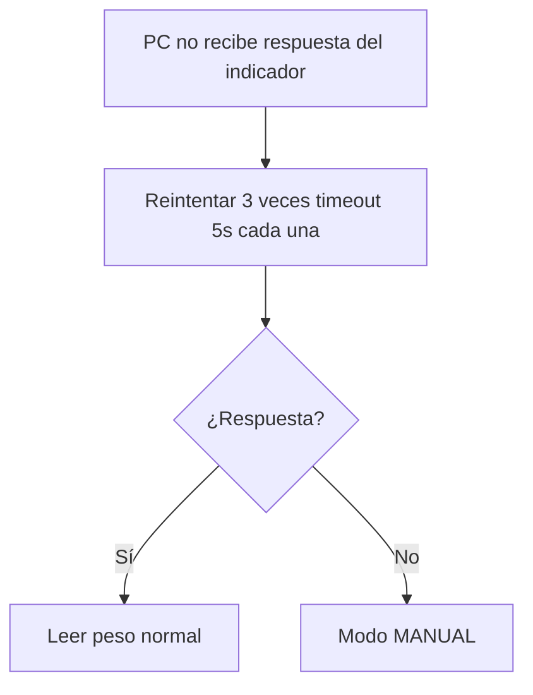

### 17.5 Modo MANUAL

Cuando no hay comunicación con el dispositivo (o la balanza no está operativa):

1. Operador (ADMIN/SUPERVISOR) selecciona "Ingreso Manual"
2. Ingresa peso del trailer y remolque
3. El boleto se marca como `boleto_tipo = MANUAL`
4. Se registra en auditoría quién ingresa el peso
5. Sistema opera normalmente

> **Permisos:** el peso manual solo está habilitado para **ADMIN/SUPERVISOR** (`_PERMISOS_PESO_MANUAL`); el OPERADOR no puede ingresar pesos manualmente.

### 17.6 Servicio de Detección

En el backend vigente no existe `BalanzaService` de HAL; el catálogo de balanzas se administra vía CRUD (`/api/v1/balanzas`, requieren `require_admin` para escritura) y el cambio de estado operativo queda registrado en auditoría (`balanzas.estado`). La detección física/comunicación del indicador corresponde a la estación futura; el contrato de peso por API ya contempla el `id_balanza` en el boleto.

```python
@router.post("/balanzas")                 # [ADMIN] crear balanza
@router.put("/balanzas/{id_balanza}")     # [ADMIN] cambiar estado/mantención
# Verificar estado físico/Comunicación → implementación futura en estación (no en backend)
```

### 17.7 Dashboard - Estado Balanzas

```text

┌─────────────────────────────────────────────────────────┐
│  ESTADO DE BALANZAS                                     │
├─────────────────────────────────────────────────────────┤
│                                                         │
│  [GREEN] Balanza ENTRADA 1 - OPERATIVA                  │
│     Último peso recibido por API: 12,450 kg hace 2 min  │
│                                                         │
│  [YELLOW] Balanza SALIDA 1 - MANTENIMIENTO              │
│     Motivo: Calibración programada                      │
│     Desde: 08/09/2026 08:00                             │
│                                                         │
│  [ALERT] Modo activo: ENTRADA (peso vía API / Manual)   │
│                                                         │
└─────────────────────────────────────────────────────────┘

```

## 18. Roadmap

| Fase                                      | Tiempo     |
|-------------------------------------------|------------|
| Backend FastAPI + DB (schema.sql + migraciones) | 3 sem |
| Multi-empresa + Roles + JWT               | 1 sem      |
| Workflow pesaje + Kardex numérico         | 1 sem      |
| Integración peso por API / modo manual    | 1 sem      |
| Estación/hardware futura (peso, cámaras, barreras) | 1 sem |
| Integración semáforos/barreras (estación) | 1 sem      |
| Frontend Flutter (login, dashboard, pesaje) | 3 sem   |
| Frontend catálogos, kardex, consultas     | 2 sem      |
| Testing y ajustes                         | 1 sem      |
| **Total**                                 | **14 sem** |

---

## 19. Supuestos

### Hardware

> Supuestos de **estación futura**: el backend actual recibe el peso por API y el modo manual está restringido a ADMIN/SUPERVISOR.

1. Una estación puede manejar múltiples dispositivos (balanzas/indicadores)
2. Cadena: Báscula física → Indicador → Estación (futura)
3. Las balanzas se definen con tipo: ENTRADA o SALIDA
4. Existe al menos 1 balanza de entrada y 1 de salida
5. La estación tiene puerto serial disponible o adaptador USB-RS232
6. Las cámaras IP son compatibles con RTSP/ONVIF
7. Semáforos y barreras se controlan vía serial/USB

### Operación

1. 1 operador por estación (no concurrencia en mismo hardware)
2. El pesaje es en 2 pasadas (entrada y salida separadas)
3. Puede usarse la misma balanza para entrada y salida (conmutación)
4. Cada pesaje tiene 1 solo producto (no mezcla)
5. El vehículo entra vacío y sale lleno (o viceversa)
6. El peso se acepta solo si la estabilidad se mantiene por 3 segundos

### Contingencia

 1. Fallo físico de balanza (celdas, mantenimiento) → Mover camión a otra báscula operativa
 2. Si no hay otra balanza disponible → Modo MANUAL
 3. Fallo de comunicación PC-device → Modo MANUAL
 4. El boleto en modo MANUAL se marca como `boleto_tipo = MANUAL`
 5. Todo cambio de estado de balanza se registra en auditoría

### Datos

 1. **PostgreSQL 15+** (producción); esquema en `backend/schema.sql` + `migrations/*.sql`, instalado con `scripts/setup_db.sh`; SQLite no se usa (la BD de tests es PostgreSQL real `balansoft_ws_test`)
 2. Almacenamiento local suficiente para imágenes (500GB+)
 3. No se requiere replicación de base de datos
 4. Todos los timestamps se almacenan en UTC+00
 5. La TZ local se configura por empresa y se convierte solo en la capa de presentación (Flutter)
 6. Formato numérico configurable por empresa (separador decimal/miles)
 7. Formato de fecha configurable por empresa
 8. Sistema de unidades: METRICO (default) o IMPERIAL

### Validación

 1. Si la lectura reporta LBS y la empresa usa KG → ALERTA, no registra
 2. Si la lectura reporta KG y la empresa usa LBS → ALERTA, no registra

### Conectividad

 1. Modo offline como primario, sincronización secundaria
 2. No se requiere app móvil para conductores

### Seguridad

 1. Acceso físico controlado a la PC / estación
 2. No se requiere autenticación biométrica
 3. Multi-empresa: una sola instalación por empresa, con aislamiento por `id_empresa` resuelto del JWT

### Negocio

 1. El sistema es para uso interno (no venta al público)
 2. No se requiere facturación integrada
 3. Los reportes son para uso interno, no fiscal

### UI / Experiencia de Usuario

 1. **Tema Claro/Oscuro**: Sistema debe permitir cambiar entre tema claro (light) y oscuro (dark)
 2. Preferencia de tema se almacena por dispositivo (SharedPreferences local en Flutter, `ThemeController`)
 3. El tema oscuro es recomendado para operación en kiosk (menos fatiga ocular)
 4. El tema claro es default para uso administrativo
 5. Cambio de tema es inmediato sin necesidad de recargar página
 6. Ambos temas: compatible con escala de grises para accesibilidad
 7. Contraste mínimo WCAG AA en ambos temas

---

*BALANSOFT v2.0*
