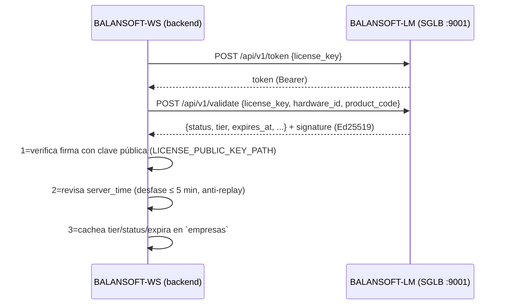

# RESUMEN — API de BALANSOFT-WS y validación de licencias

| Atributo  | Valor |
|-----------|-------|
| **Documento** | RESUMEN-API-LICENCIAS.md |
| **Versión**  | 1.0 |
| **Fecha**    | 2026-09-14 |
| **Estado**   | Vigente |
| **Autor**    | Equipo BALANSOFT |
| **Norma**    | ISO/IEC/IEEE 42010 + 29148 |
| **Fuente**   | `docs/PRD.md` (autoridad), `docs/ARCH.md`, OpenAPI del backend |

---

## 1. Qué es el sistema

**BALANSOFT-WS** es la estación de pesaje industrial (multi-empresa): una **API REST
FastAPI** que consumen las estaciones Flutter (web/desktop/móvil, offline-first).
La **validez de cada empresa para operar** la decide el **License Manager
(BALANSOFT-LM / SGLB)**, un sistema independiente que ya vive en este mismo
servidor:

| Componente | Servicio | Endpoint |
|------------|----------|----------|
| BALANSOFT-WS API | `balansoft-ws.service` | `127.0.0.1:8002` |
| BALANSOFT-LM API (validación) | `balansoft-lm-api.service` | `127.0.0.1:9001/api/v1` |
| BALANSOFT-LM Portal (admin) | `balansoft-lm.service` | `127.0.0.1:9000` |
| Landing / otros | `balansoft.service`, `balansoft-sg.service` | `:8000`, `:8001` |

Producto en el LM: **`WS`** (clave pública de firma en `backend/keys/lm_public_key.pem`).

---

## 2. La API de BALANSOFT-WS

Base: `http://<servidor>:8002/api/v1`. Autenticación: `Authorization: Bearer <access_token>` (JWT HS256; refresh con `POST /auth/refresh-token`). Toda entidad es multi-empresa (se aísla por `id_empresa` del token).

### 2.1 Auth y licencias — `prefix /api/v1/auth`

| Método | Ruta | Descripción |
|--------|------|-------------|
| POST | `/register` | Alta de empresa + primer admin. **Exige `licencia_key`** y la verifica contra el LM (`check`) antes de crear. |
| POST | `/login` | Login. Si la empresa tiene licencia, la **valida online** contra el LM (`validate`) y guarda tier/status/vencimiento. 403 si inválida, 503 si el LM no responde. |
| POST | `/refresh-token` | Renueva el access token con el refresh token. |
| POST | `/logout` | Cierra sesión (revoca refresh). |
| POST | `/forgot-password` / `/reset-password` | Recuperación de contraseña. |
| POST | `/validate-license` | Validación manual en tiempo real de la licencia de la empresa (ADMIN). |
| GET  | `/license` | Snapshot de licencia para la UI: `valid`, `status`, `tier`, `expires_at`, `features` y consumo de registros (límite DEMO). |

### 2.2 Pesaje — `prefix /api/v1/weighing`

| Método | Ruta | Descripción |
|--------|------|-------------|
| POST | `/create` | Crea boleto (entrada). **Valida licencia online** si la empresa tiene `licencia_key`. |
| POST | `/close/{boleto}` | Cierra (salida) y calcula PNT/diferencias. |
| PUT  | `/{boleto}` | Modifica (estado → MODIFICADO). |
| PUT  | `/{boleto}/anular` | Anula (solo ADMIN/SUPERVISOR; no reutiliza número; inverte kardex). |
| GET  | `/pendientes` · `/list` · `/boleto/{boleto}` | Listados y detalle. |
| GET  | `/{boleto}/pdf` | Ticket PDF (marca de agua en anulados). |
| GET/POST/DELETE | `/{boleto}/imagenes...` | Fotos del boleto. |
| GET  | `/scale/{balanza_id}/live` | Peso en vivo vía HAL (serial/TCP), REQ-NF-ARQ-004. |

### 2.3 Catálogos (flota, inventario, directorio) — `prefix /api/v1`

| Módulo | CRUD | Rutas (`GET` listar, `POST`, `PUT`, `DELETE`) |
|--------|------|--------|
| Flota | Marcas, Modelos, Camiones (+`/camiones/buscar`), Remolques | `/marcas`, `/modelos-camion`, `/camiones`, `/remolques` |
| Inventario | Productos, Almacenes, Balanzas (+`/balanzas/{id}/probar`) | `/productos`, `/almacenes`, `/balanzas` |
| Directorio | Transportes, Conductores, Terceros | `/transportes`, `/conductores`, `/terceros` |

Los CREATE/UPDATE requieren rol catálogo (`require_catalog_manager`); las balanzas, además, `require_admin`. Todos los cambios de escritura auditan (REQ-NF-SEG-001).

### 2.4 Reportes y exportación — `prefix /api/v1/reports` (+`/files`)

- Reportes: `daily`, `monthly`, `vehicle/{id}`, `transportista`, `tercero`, `peso-rango`, `comparativo-mensual`, `kardex/saldo`, `kardex/detalle`.
- Exportación: `export/excel`, `export/kardex/excel`, `export/kardex/pdf`; archivos adjuntos en `/api/v1/files/upload`.

### 2.5 Sincronización offline — `prefix /api/v1/sync` y `/catalogo`

- `POST /sync/push` (cola pendiente→sincronizado), `GET /sync/pull`, `GET /sync/status`.
- `GET /catalogo/sync`: catálogos combinados para la estación offline.

### 2.6 Operación

- `GET /api/v1/health` (estado + versión) y `GET /metrics` (Prometheus).

---

## 3. Cómo se validan las licencias

### 3.1 Responsables

| Pieza | Rol |
|-------|-----|
| **BALANSOFT-LM (SGLB)** | Emite tokens y responde `POST /api/v1/validate` **firmadas con Ed25519** usando su clave **privada**. Portal admin para crear/asignar licencias. |
| **BALANSOFT-WS** | Cliente `LicenseClient` (`app/core/license_client.py`). Verifica la firma con la clave **pública** del LM (`LICENSE_PUBLIC_KEY_PATH`) y **no confía** en un servidor falso. |
| **BD de negocio** | `empresas.licencia_key / licencia_tier / licencia_status / licencia_expira` cachean el resultado de la validación. |

### 3.2 Flujo anti-fake-server



Detalle del `validate` en `LicenseClient`:
1. `POST {base}/token` con la `license_key` → obtiene un Bearer.
2. `POST {base}/validate` con licencia, `hardware_id`, `mac`, brand/model/OS y `product_code` (todo bajo el Bearer).
3. Verifica la **firma Ed25519** sobre los campos firmados (`valid`, `status`, `expires_at`, `tier`, `server_time`, `nonce`, …). Firma inválida ⇒ `LicenseSignatureError` (no se "perdona").
4. Anti-replay: el `server_time` del LM no debe desviarse > 5 min de la hora del servidor.
5. Resultado: `valid + status + tier + expires_at + features` → se guarda en la empresa.

### 3.3 En qué momentos se valida

| Momento | Endpoint WS | Efecto si no es válida |
|---------|-------------|------------------------|
| Alta de empresa | `POST /auth/register` | Se exige `licencia_key` y se contrasta con `check` del LM; si falla no se crea la empresa (400). |
| Login | `POST /auth/login` | 403 "Licencia inválida o expirada"; 503 si el LM está caído. |
| Crear pesaje | `POST /weighing/create` | 403 si inválida/expirada; 503 si el LM no responde (no se opera sin licencia verificada). |
| Manual | `POST /auth/validate-license` | Devuelve el estado real en JSON para que la UI (ADMIN) lo muestre. |
| Consulta | `GET /auth/license` | Snapshot (tier, vencimiento, límites, consumo) — no valida contra el LM. |

> Si `empresas.licencia_key` está **vacía**, el sistema opera **sin validación online**
> (estado "SIN_LICENCIA", típico de la empresa demo). Con `licencia_key` asignada la
> validación pasa a ser obligatoria en login y creación de pesaje.

### 3.4 Límites por tier

| Tier | Límite aplicado de `config.py` |
|------|-------------------------------|
| DEMO | `demo_max_records` (default 10 boletos) — se expone vía `GET /auth/license` y se muestra consumo contra el tope. |
| MONOPUESTA | 1 usuario / 1 sesión. |
| CENTRAL | `central_max_users` (default 10), multi-dispositivo. |

También por tier se incrementan las métricas Prometheus (`pesajes_total{status,tier}`, `active_users{tier}`, `license_errors{tier,reason}`) y se registra auditoría de operación.

### 3.5 Cómo se enlaza una licencia en producción

1. En el **portal del LM** (`http://<servidor>:9000`) se crea una licencia del producto **WS** (tier DEMO/MONOPUESTA/CENTRAL) para el cliente.
2. El cliente crea su empresa con `POST /auth/register` enviando ese `licencia_key` → el WS la valida (`check`) y cachea tier/status. (Alternativa: actualizar `empresas.licencia_key` por admin/DBA.)
3. A partir de ahí, cada login y cada pesaje valida la licencia contra el LM; el `hardware_id` debe coincidir con el del `fingerprint` activado para el tier DEMO/MONOPUESTA (un solo dispositivo).

### 3.6 Configuración en este servidor (`backend/.env`)

```ini
LICENSE_API_URL=http://127.0.0.1:9001/api/v1
LICENSE_ADMIN_URL=http://127.0.0.1:9000
LICENSE_PUBLIC_KEY_PATH=keys/lm_public_key.pem   # clave pública del LM (Ed25519)
LICENSE_PRODUCT_CODE=WS
```

Prueba rápida de integración:

```bash
curl -s http://127.0.0.1:9001/api/v1/health            # LM arriba
curl -s http://127.0.0.1:8002/api/v1/health            # WS arriba
bash scripts/verify.sh                                  # chequeo [7] LM accesible
```

---

## 4. Notas

- **`docs/DOCUMENTACION-BALANSOFT-WS.md` no es autoritativo** (histórico .NET). La fuente de verdad es `docs/PRD.md`.
- La clave pública no es secreto; la privada vive solo en el LM (`/var/www/BALANSOFT-LM/keys/ml_private_key.pem`, permisos 600) y **nunca** debe subirse al repo.