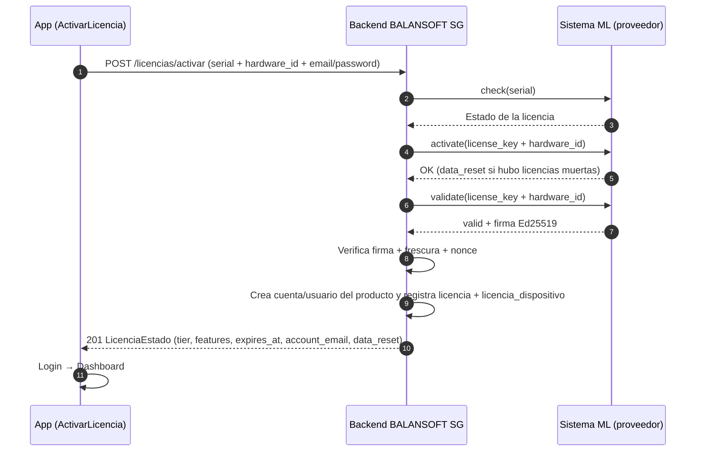
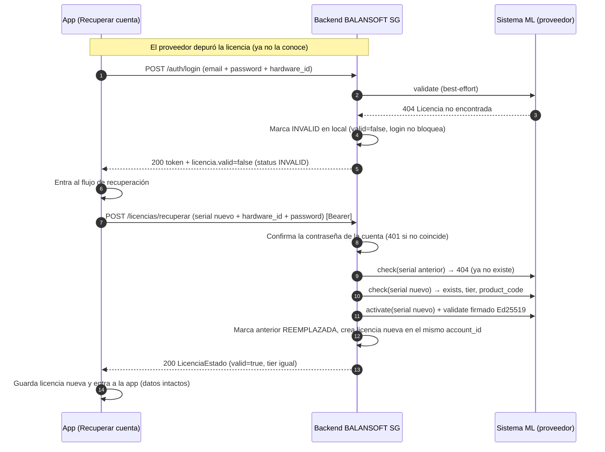

# BALANSOFT SG — Planes de Licencia y Alcances

**Versión:** 3.3 | **Fecha:** 21 de agosto de 2026  
**Fuente de verdad:** `docs/PRD.md` v3.3 · `docs/ARCH.md` v3.3 · `docs/SPEC.md` v3.3

---

## 1. Introducción

Este documento define los planes de licencia de BALANSOFT SG, sus alcances funcionales, límites técnicos y reglas de negocio. Sirve como guía para:

- **Clientes y distribuidores:** Para entender qué incluye cada plan.
- **Desarrolladores:** Para implementar las validaciones correspondientes.
- **Soporte:** Para resolver dudas sobre capacidades y limitaciones.

---

## 2. Tipos de Licencia (`tier`)

BALANSOFT SG ofrece tres tipos de licencia que determinan el modelo de concurrencia:

| Tipo | Descripción | Concurrencia |
| :--- | :--- | :--- |
| **MONOPUESTO** | Licencia personal para un único dispositivo. Ideal para productores independientes o pequeñas explotaciones que operan desde un solo equipo. | 1 dispositivo |
| **CENTRAL** | Licencia multi-sesión para una misma cuenta. Permite que el productor opere desde múltiples dispositivos simultáneamente. Ideal para equipos de trabajo o para quien necesita acceso desde campo y oficina. | Múltiples dispositivos (límite definido por `max_activations` del proveedor) |
| **DEMO** | Versión de prueba gratuita con limitaciones. Diseñada para que los usuarios evalúen el sistema antes de adquirir una licencia de pago. | 1 dispositivo |

> **Nota sobre CENTRAL:** El primer dispositivo registrado es el **dueño** de la licencia. Los dispositivos adicionales se inscriben en `licencia_dispositivo` y ocupan un cupo del límite `max_activations`. Al cerrar sesión (`POST /licencias/logout`), se libera el cupo del dispositivo.

---

## 3. Planes de Alcance Funcional (`plan_type`)

Independientemente del tipo de licencia, cada una puede adquirirse en dos planes que determinan el **alcance funcional**:

| Plan | Descripción |
| :--- | :--- |
| **Básico** | Funcionalidad esencial para la gestión ganadera. Cubre el núcleo de la plataforma y los módulos principales sin funcionalidades avanzadas. |
| **Premium** | Funcionalidad completa. Incluye todas las características del Básico más módulos avanzados de trazabilidad, inventario, análisis y multi-hato. |

---

## 4. Alcance Funcional por Plan

### 4.1 Núcleo de Plataforma (Incluido en ambos planes)

**Componentes transversales disponibles en todos los planes:**

| Área | RFs Incluidos |
| :--- | :--- |
| **Usuarios y permisos** | PLAT-01..04 (gestión de usuarios, roles, acceso por hato, auditoría) |
| **Cliente y offline** | PLAT-05..11 (app multiplataforma, UI adaptable, offline-first, sincronización, persistencia local, flujo de arranque, conectividad intermitente) |
| **Catálogos de referencia** | PLAT-12 (actualización de curvas, razas, insumos) |
| **Licencia** | PLAT-13..14 (activación, validación Ed25519) y PLAT-45 (recuperación de cuenta) |
| **CRUD de hatos** | PLAT-15 (creación, edición y baja de hatos) |
| **Incidencias** | PLAT-22..27 (registro, severidad, alertas, vinculación sanitaria, seguimiento) |
| **UX System** | PLAT-28..32 (temas, paletas, semáforo 1-5, contraste AA, feedback de acciones) |
| **Marca** | PLAT-33..35 (wordmark, fuente Blade Runner) |
| **Dispositivo** | PLAT-36..41 (orientación, assets offline, feedback háptico, legibilidad solar, uso con guantes) |
| **Importación de datos** | PLAT-42 (migración desde Excel/sistemas previos) |
| **Internacionalización** | PLAT-44 (español, portugués, inglés) |
| **Modo desktop** | PLAT-43 (UI adaptada a pantalla amplia) |

### 4.2 Plan Básico

**Incluye todo el núcleo de plataforma + los siguientes módulos:**

| Dominio | RFs Incluidos | Excluye |
| :--- | :--- | :--- |
| **Comunes (COM)** | COM-01..07, COM-09..48, COM-50..51, COM-56, COM-63..67 | COM-08 (RFID), COM-28 (BCS estimado), COM-31 (rotación potreros), COM-49 (exportación PDF), COM-57 (alertas stock), COM-58..62 (inventario veterinario) |
| **Engorde (ENG)** | ENG-01..05 (completos) | — |
| **Reproducción (REP)** | REP-01..13 (completos) | — |
| **Lechería (LEC)** | LEC-01..05 (completos) | — |
| **Comercial (VEN)** | VEN-01..04 (completos) | — |
| **Finanzas (FIN)** | FIN-01..03 (completos) | — |
| **Multi-hato avanzado** | — | PLAT-16..21 (selector global, permisos por hato, KPIs ponderados, reportes consolidados, transferencia, jerarquía) |

### 4.3 Plan Premium

**Incluye todo el Plan Básico + las siguientes funcionalidades exclusivas:**

| Área | RFs Adicionales | Descripción |
| :--- | :--- | :--- |
| **RFID** | COM-08 | Identificación automática del animal con lector RFID |
| **BCS estimado** | COM-28 | Estimación automática de condición corporal desde el peso |
| **Rotación de potreros** | COM-31 | Movimientos con historial de ocupación |
| **Exportación PDF** | COM-49 | Exportación de informes en formato PDF |
| **Alertas de stock** | COM-57 | Aviso de mínimos y días restantes de insumo |
| **Inventario veterinario** | COM-58..62 | Stock veterinario por lote, control de vencimiento, alertas, descarga automática por evento sanitario, reportes de movimientos |
| **Multi-hato avanzado** | PLAT-16..21 | Selector global, permisos por hato, KPIs ponderados, reportes consolidados, transferencia entre hatos, jerarquía de hatos |

---

## 5. Límites por Plan y Tipo de Licencia

### 5.1 Matriz de Límites

| Tipo (`tier`) | Plan (`plan_type`) | Límite de Hatos | Límite de Animales | Límite de Registros Totales | Exportaciones | Concurrencia |
| :--- | :--- | :--- | :--- | :--- | :--- | :--- |
| **MONOPUESTO** | Básico | **3** | Sin límite | Sin límite | Sin marca de agua | 1 dispositivo |
| **MONOPUESTO** | Premium | Ilimitados | Sin límite | Sin límite | Sin marca de agua | 1 dispositivo |
| **CENTRAL** | Básico | **1** | Sin límite | Sin límite | Sin marca de agua | Múltiples disp. |
| **CENTRAL** | Premium | Ilimitados | Sin límite | Sin límite | Sin marca de agua | Múltiples disp. |
| **DEMO** | Básico | **1** | **Máx. 50** | **Máx. 200** | **Con marca de agua** | 1 dispositivo |

### 5.2 Detalle de Límites

#### 5.2.1 Límite de Hatos

- **MONOPUESTO Básico:** Máximo 3 hatos por cuenta.
- **CENTRAL Básico:** Máximo 1 hato por cuenta.
- **Premium (MONOPUESTO o CENTRAL):** Ilimitados.
- **DEMO:** Máximo 1 hato.

#### 5.2.2 Límite de Animales (solo DEMO)

- **Máximo 50 animales** en toda la cuenta.
- Aplica al dar de alta un animal (`POST /animales`).
- Al alcanzar el límite, el backend responde con error `403 DEMO_LIMIT_REACHED`.

#### 5.2.3 Límite de Registros Totales (solo DEMO)

- **Máximo 200 registros** en total (suma de pesajes, eventos sanitarios, servicios, partos, producciones de leche, etc.).
- Se calcula sobre todas las tablas de negocio que generan registros transaccionales.
- Al alcanzar el límite, el backend responde con error `403 DEMO_LIMIT_REACHED`.

#### 5.2.4 Exportaciones (solo DEMO)

- **Todas las exportaciones (CSV y PDF) incluyen marca de agua** con el texto "DEMO" o "VERSIÓN DE PRUEBA".
- La marca de agua se inyecta en el backend, no en el cliente, para evitar su eliminación.

#### 5.2.5 Vigencia (solo DEMO)

- La licencia DEMO puede tener una fecha de expiración (ej. 30 días desde la activación).
- El backend verifica `expires_at` en cada solicitud.
- Al expirar, responde con error `403 DEMO_EXPIRED`.

---

## 6. Resumen Ejecutivo de Planes

### Plan Básico — MONOPUESTO

**Ideal para:** Productores independientes con hasta 3 hatos que operan desde un solo dispositivo.

**Incluye:**
- Gestión completa de animales, pesajes, crecimiento, sanidad, reproducción, lechería, engorde, comercial y finanzas.
- Operación offline-first y sincronización automática.
- Hasta 3 hatos.
- **No incluye:** RFID, BCS estimado, rotación de potreros, exportación PDF, alertas de stock, inventario veterinario, multi-hato avanzado.

**Precio:** $750 / 10 licencias ($75 c/u)

---

### Plan Premium — MONOPUESTO

**Ideal para:** Productores que requieren funcionalidades avanzadas de trazabilidad e inventario en un solo dispositivo.

**Incluye:**
- Todo el Plan Básico.
- RFID, BCS estimado, rotación de potreros, exportación PDF.
- Alertas de stock e inventario veterinario completo.
- Hatos ilimitados.

**Precio:** $1.200 / 10 licencias ($120 c/u)

---

### Plan Básico — CENTRAL

**Ideal para:** Equipos de trabajo o productores que necesitan operar desde múltiples dispositivos (campo y oficina) con un solo hato.

**Incluye:**
- Todo el Plan Básico.
- Múltiples dispositivos simultáneos.
- **Limitado a 1 hato.**

**Precio:** $750 / 10 licencias ($75 c/u)

---

### Plan Premium — CENTRAL

**Ideal para:** Empresas ganaderas con múltiples hatos que requieren funcionalidades avanzadas y operación desde varios dispositivos.

**Incluye:**
- Todo el Plan Premium.
- Múltiples dispositivos simultáneos.
- Multi-hato avanzado (selector global, permisos por hato, KPIs ponderados, reportes consolidados).
- Hatos ilimitados.

**Precio:** $1.200 / 10 licencias ($120 c/u)

---

### DEMO

**Ideal para:** Evaluar el sistema antes de comprar.

**Incluye:**
- Todo el Plan Básico.
- **Limitado a:** 1 hato, 50 animales, 200 registros totales.
- Exportaciones con marca de agua.
- Vigencia temporal (30 días).
- Una sola activación por cuenta.

**Precio:** Gratuita (de un solo uso por cuenta)

---

## 7. Reglas de Negocio y Validaciones

### 7.1 Validaciones en el Backend

| Regla | Endpoint | Validación | Error |
| :--- | :--- | :--- | :--- |
| Límite de hatos | `POST /hatos` | `COUNT(hato.id) < límite_del_plan` | `403 PLAN_LIMIT` |
| Límite de animales (DEMO) | `POST /animales` | `COUNT(animal.id) < 50` | `403 DEMO_LIMIT_REACHED` |
| Límite de registros (DEMO) | `POST /pesajes`, `POST /eventos-sanitarios`, etc. | Suma total de registros < 200 | `403 DEMO_LIMIT_REACHED` |
| Marca de agua (DEMO) | `GET /reportes/{id}/export` | Inyectar marca de agua en PDF/CSV | — |
| Vigencia (DEMO) | Todas las solicitudes | `expires_at > NOW()` | `403 DEMO_EXPIRED` |
| DEMO de un solo uso | `POST /licencias/activar` | La cuenta no ha usado DEMO antes | `409 DEMO_USADO` |
| Límite de dispositivos (CENTRAL) | `POST /licencias/activar` | `count(licencia_dispositivo) < max_activations` | `400 MAX_DEVICES_REACHED` |

### 7.2 Implementación en Sincronización Offline (Outbox)

El límite de hatos del plan se aplica **también en el outbox**, no solo en el CRUD:

- Una creación de `hato` que exceda el máximo del plan se responde con `DESCARTADO`.
- El pull posterior elimina la entidad del espejo local.
- Los registros rechazados se confirman en el outbox al primer intento y el pull los poda.

---

## 8. Códigos de Error Específicos de Licencia

| Código | HTTP | Uso |
| :--- | :--- | :--- |
| `PLAN_LIMIT` | 403 | La cuenta alcanzó el límite de su plan (hatos, animales o registros) |
| `DEMO_LIMIT_REACHED` | 403 | La demo alcanzó el límite de animales (50) o registros totales (200) |
| `DEMO_EXPIRED` | 403 | La demo ha expirado (vigencia superada) |
| `DEMO_USADO` | 409 | La cuenta ya usó su única licencia DEMO de prueba |
| `MAX_DEVICES_REACHED` | 400 | La licencia CENTRAL alcanzó el tope de dispositivos simultáneos |
| `DEVICE_NOT_REGISTERED` | 400 | El hardware no está registrado en la licencia CENTRAL |
| `LICENSE_DEVICE_MISMATCH` | 403 | El login de MONOPUESTO/DEMO viene de un equipo distinto al dueño |
| `DUPLICATE_DEVICE_LICENSE` | 400 | El dispositivo ya tiene una licencia de este producto |
| `LICENSE_INVALID` | 400 | Firma Ed25519 inválida o licencia de otro tipo en la recuperación |
| `LICENCIA_VIGENTE` | 409 | La licencia anterior de la cuenta sigue vigente en el proveedor |

---

## 9. Flujos de Activación y Recuperación

### 9.1 Activación de Licencia

### 9.2 Recuperación de Cuenta (PLAT-45)

Cuando el proveedor ya no reconoce la licencia (BD depurada), el dueño puede recuperar su cuenta con una licencia nueva del mismo `tier`:

---

## 10. Preguntas Frecuentes

### ¿Puedo cambiar de plan después de activar?

Sí, el usuario puede adquirir una licencia de un plan superior (ej. de Básico a Premium). El backend adopta la nueva licencia al revalidar o al hacer login.

### ¿Puedo usar una licencia MONOPUESTO en otro dispositivo?

No. MONOPUESTO está ligado al `hardware_id` del dispositivo donde se activó. Si el dispositivo se daña, el distribuidor debe reasignar la licencia.

### ¿Cuántos dispositivos permite CENTRAL?

El límite lo define el proveedor ML en `max_activations`. El primer dispositivo es el dueño; los adicionales ocupan cupo. Al cerrar sesión se libera el cupo.

### ¿Qué pasa si la DEMO expira?

El sistema bloquea la app con el mensaje "DEMO expirada" y redirige al usuario a adquirir una licencia de pago.

### ¿Puedo activar dos DEMO en la misma cuenta?

No. Cada cuenta solo puede usar una licencia DEMO. Al intentar activar otra, el backend responde `409 DEMO_USADO`.

### ¿La marca de agua en exportaciones DEMO se aplica también a CSV?

Sí, en el CSV se añade una fila de comentario o una columna adicional con el texto "DEMO - VERSIÓN DE PRUEBA".

### ¿Los límites de la DEMO se aplican en offline?

Sí. El outbox envía los registros al backend, y el backend los valida y descarta si se exceden los límites. El cliente recibe el estado `DESCARTADO` y elimina el registro local.

---

## 11. Documentación Relacionada

| Documento | Descripción |
| :--- | :--- |
| `PRD.md` | Requisitos funcionales y no funcionales completos |
| `ARCH.md` | Arquitectura del sistema, diagramas de contexto y contenedores |
| `SPEC.md` | Especificación técnica detallada (API, modelo de datos, sincronización) |
| `USO-API.md` | Especificación de la API del sistema ML (proveedor de licencias) |
